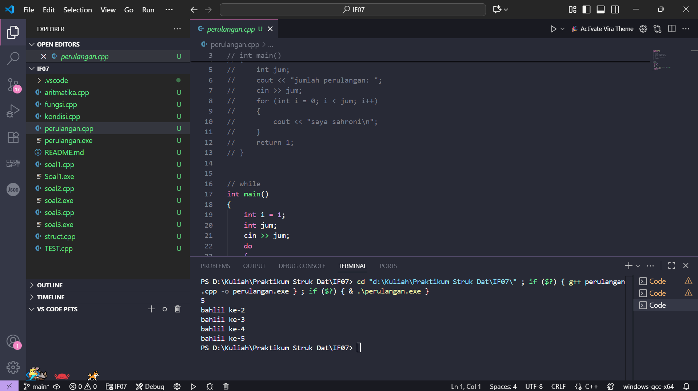
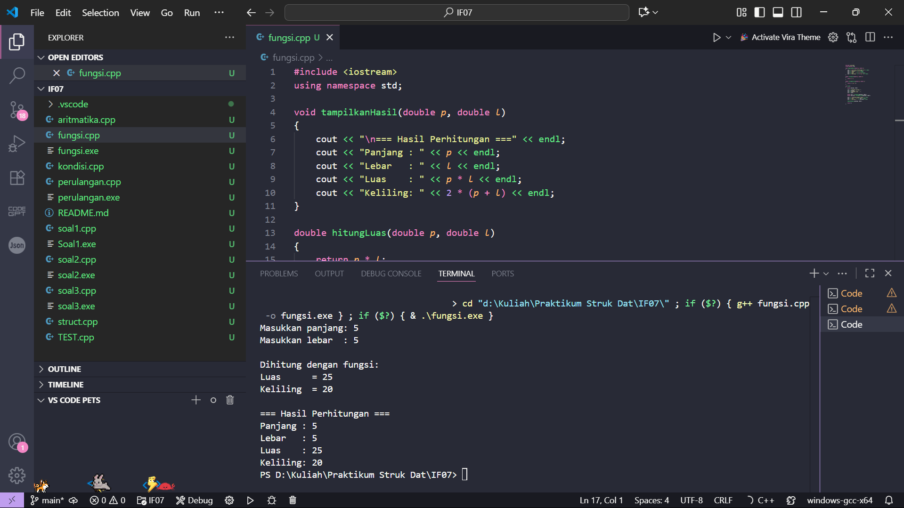
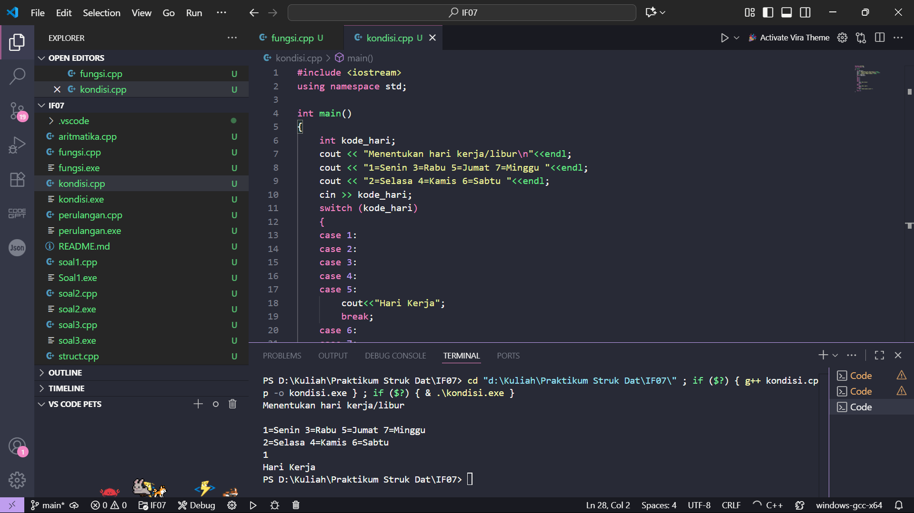
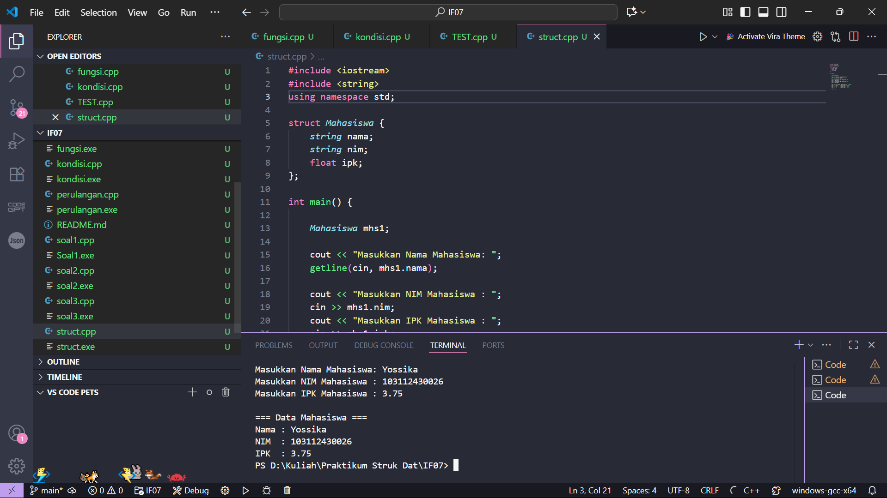
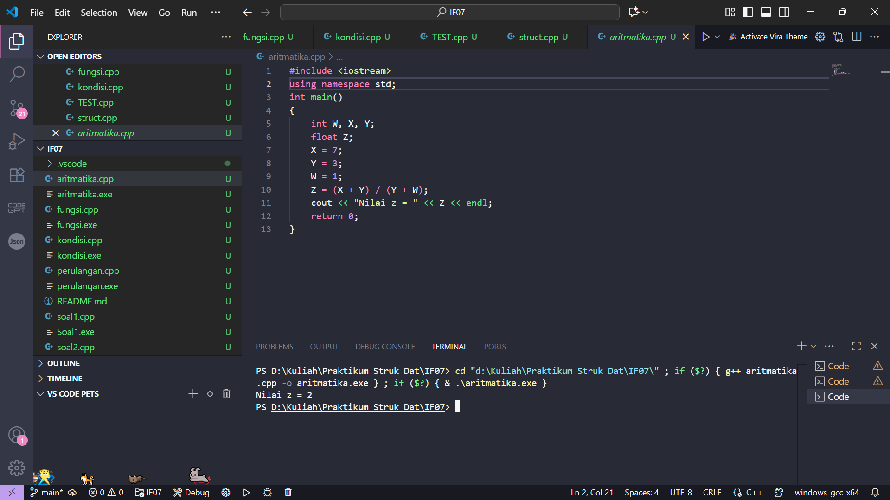

# <h1 align="center">Laporan Praktikum Modul X <br> Modul 1 Pengenalan C++ </h1>
<p align="center">Salsabilla Nurul Hassanah - 103112430256</p>

## Dasar Teori

Pemrograman dengan C++ merupakan salah satu dasar penting dalam pembelajaran algoritma karena mendukung operasi input, proses, dan output secara terstruktur. Pada soal pertama, konsep yang digunakan adalah tipe data float dan operator aritmatika (+, -, *, /) untuk melakukan perhitungan matematis. Soal kedua menerapkan logika pemetaan (mapping) dan percabangan untuk mengubah angka bulat 0–100 menjadi bentuk teks, yang banyak diaplikasikan pada sistem konversi angka ke tulisan. Sementara itu, soal ketiga melatih pemahaman looping bersarang (nested loop) untuk membentuk pola angka dengan format tertentu. Ketiga latihan ini menunjukkan penerapan dasar teori pemrograman, yaitu bagaimana data dari pengguna diproses melalui algoritma yang sesuai, lalu menghasilkan keluaran yang diharapkan.

## Guided

### Soal 1

Mengerjakan Perulangan

```cpp
#include <iostream>
using namespace std;
// int main()
// {
//     int jum;
//     cout << "jumlah perulangan: ";
//     cin >> jum;
//     for (int i = 0; i < jum; i++)
//     {
//         cout << "saya sahroni\n";
//     }
//     return 1;
// }


// while
int main()
{
    int i = 1;
    int jum;
    cin >> jum;
    do
    {
        cout << "bahlil ke-" << (i + 1) << endl;
        i++;
    } while (i < jum);
    return 0;
}
```

> Output  
> 

Program diminta menghitung perulangan yang di berikan user dan keluar akan mengulang sebanyak yang di input oleh user

---

### Soal 2

Mengerjakan Fungsi 

```cpp
#include <iostream>
using namespace std;

void tampilkanHasil(double p, double l)
{
    cout << "\n=== Hasil Perhitungan ===" << endl;
    cout << "Panjang : " << p << endl;
    cout << "Lebar   : " << l << endl;
    cout << "Luas    : " << p * l << endl;
    cout << "Keliling: " << 2 * (p + l) << endl;
}

double hitungLuas(double p, double l)
{
    return p * l;
}

double hitungKeliling(double p, double l)
{
    return 2 * (p + l);
}

int main()
{
    double panjang, lebar;

    cout << "Masukkan panjang: ";
    cin >> panjang;
    cout << "Masukkan lebar  : ";
    cin >> lebar;

    double luas = hitungLuas(panjang, lebar);
    double keliling = hitungKeliling(panjang, lebar);

    cout << "\nDihitung dengan fungsi:" << endl;
    cout << "Luas      = " << luas << endl;
    cout << "Keliling  = " << keliling << endl;

    tampilkanHasil(panjang, lebar);

    return 0;
}

```

> Output  
> 

Progam di minta menghitung luas keliling, menentukan panjang, lebar, luas, keliling

### Soal 3

Mengerjakan kondisi hari Kerja dan Libur

```cpp
#include <iostream>
using namespace std;

int main()
{
    int kode_hari;
    cout << "Menentukan hari kerja/libur\n"<<endl;
    cout << "1=Senin 3=Rabu 5=Jumat 7=Minggu "<<endl;
    cout << "2=Selasa 4=Kamis 6=Sabtu "<<endl;
    cin >> kode_hari;
    switch (kode_hari)
    {
    case 1:
    case 2:
    case 3:
    case 4:
    case 5:
        cout<<"Hari Kerja";
        break;
    case 6:
    case 7:
        cout<<"Hari Libur";
        break;
    default:
        cout<<"Kode masukan salah!!!";
    }
    return 0;
}

```

> Output  
> 

Progam di minta menentukan Hari Senin - Minggu, Tentukan Libur dan Kerja

### Soal 4

Mengerjakan Hitung Rumus Aritmatika

```cpp
#include <iostream>
using namespace std;
int main()
{
    int W, X, Y;
    float Z;
    X = 7;
    Y = 3;
    W = 1;
    Z = (X + Y) / (Y + W);
    cout << "Nilai z = " << Z << endl;
    return 0;
}
```

> Output  
> 

Progam di minta menghitung rumus Aritmatika yang sudah ada

### Soal 5

Mengerjakan Struct Mahasiswa

```cpp
#include <iostream>
#include <string>
using namespace std;

struct Mahasiswa {
    string nama;
    string nim;
    float ipk;
};

int main() {

    Mahasiswa mhs1;

    cout << "Masukkan Nama Mahasiswa: ";
    getline(cin, mhs1.nama);
   
    cout << "Masukkan NIM Mahasiswa : ";
    cin >> mhs1.nim;
    cout << "Masukkan IPK Mahasiswa : ";
    cin >> mhs1.ipk;

    cout << "\n=== Data Mahasiswa ===" << endl;
    cout << "Nama : " << mhs1.nama << endl;
    cout << "NIM  : " << mhs1.nim << endl;
    cout << "IPK  : " << mhs1.ipk << endl;

    return 0;
}

```

> Output  
> 

Progam di minta meyimpan data nama mahasiswa yang sudah di input oleh user


## Unguided

### Soal 1

Buatlah program yang menerima input-an dua buah bilangan bertipe float, kemudian memberikan output-an hasil penjumlahan, pengurangan, perkalian, dan pembagian dari dua bilangan tersebut.

```cpp
#include <iostream>
using namespace std;

int main() {
    float a, b;
    cout << "Masukkan bilangan pertama: ";
    cin >> a;
    cout << "Masukkan bilangan kedua: ";
    cin >> b;

    cout << "Hasil Penjumlahan: " << a + b << endl;
    cout << "Hasil Pengurangan: " << a - b << endl;
    cout << "Hasil Perkalian: " << a * b << endl;
    if (b != 0)
        cout << "Hasil Pembagian: " << a / b << endl;
    else
        cout << "Pembagian tidak dapat dilakukan (b = 0)" << endl;

    return 0;
}
```

> Output  
> 

Program diminta menampilkan hasil operasi aritmatika dari dua bilangan float. Logikanya sederhana: baca input, lakukan operasi dasar (+, -, *, /), lalu tampilkan hasilnya. Program juga melatih penggunaan kondisi sederhana untuk mencegah pembagian dengan nol.

---

### Soal 2

Buatlah sebuah program yang menerima masukan angka dan mengeluarkan output nilai angka tersebut dalam bentuk tulisan. Angka yang akan di-input-kan user adalah bilangan bulat positif mulai dari 0 s.d 100.  
Contoh: 79 → tujuh puluh sembilan

```cpp
#include <iostream>
#include <string>
using namespace std;

string angkaSatuan[] = {"nol", "satu", "dua", "tiga", "empat", "lima", 
                        "enam", "tujuh", "delapan", "sembilan"};
string angkaBelasan[] = {"sepuluh", "sebelas", "dua belas", "tiga belas", 
                         "empat belas", "lima belas", "enam belas", 
                         "tujuh belas", "delapan belas", "sembilan belas"};
string angkaPuluhan[] = {"", "", "dua puluh", "tiga puluh", "empat puluh", 
                         "lima puluh", "enam puluh", "tujuh puluh", 
                         "delapan puluh", "sembilan puluh"};

string terbilang(int n) {
    if (n < 10) return angkaSatuan[n];
    else if (n < 20) return angkaBelasan[n - 10];
    else if (n < 100) {
        int puluh = n / 10;
        int satuan = n % 10;
        if (satuan == 0) return angkaPuluhan[puluh];
        else return angkaPuluhan[puluh] + " " + angkaSatuan[satuan];
    } else if (n == 100) {
        return "seratus";
    }
    return "";
}

int main() {
    int n;
    cout << "Masukkan angka (0-100): ";
    cin >> n;
    if (n >= 0 && n <= 100) {
        cout << n << " : " << terbilang(n) << endl;
    } else {
        cout << "Angka di luar jangkauan!" << endl;
    }
    return 0;
}
```

> Output  
> 

Program membaca input bilangan bulat 0–100 lalu mengubahnya menjadi teks. Logikanya menggunakan array string untuk menyimpan kata-kata dasar angka, lalu dipetakan sesuai nilai input. Soal ini melatih penggunaan percabangan (if–else) untuk menangani kasus satuan, belasan, puluhan, dan angka seratus.

---

### Soal 3

Buatlah program yang dapat memberikan input dan output sebagai berikut.  
Input: 3  
Output:  
```
321 * 123
21 * 12
1 * 1
   *
```

```cpp
#include <iostream>
using namespace std;

int main() {
    int n;
    cout << "input: ";
    cin >> n;
    cout << "output:\n";

    for (int i = n; i >= 1; i--) {
        for (int j = i; j >= 1; j--) {
            cout << j;
        }
        cout << " * ";
        for (int j = 1; j <= i; j++) {
            cout << j;
        }
        cout << endl;
    }

    for (int spasi = 1; spasi <= n; spasi++) {
        cout << " ";
    }
    cout << "*" << endl;

    return 0;
}
```

> Output  
> 

Program menampilkan pola angka simetris dengan tanda `*` di tengah. Deret kiri menurun dari n ke 1, sedangkan deret kanan menaik dari 1 ke n. Setiap baris jumlah angkanya berkurang hingga hanya tersisa 1, kemudian ditutup dengan tanda `*` di baris paling bawah. Soal ini melatih kombinasi loop menurun, loop menaik, serta penempatan simbol khusus.

---

## Referensi

1. https://en.wikipedia.org/wiki/Data_structure (diakses 28-09-2025)
