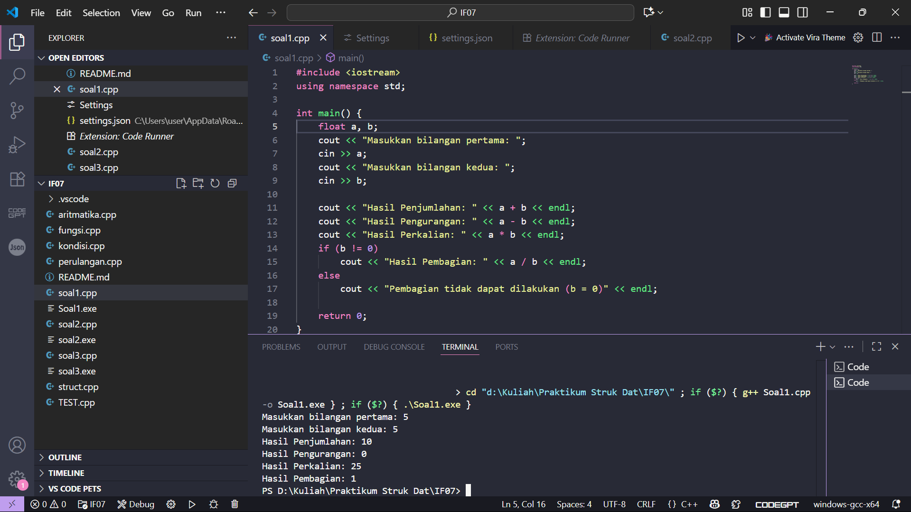
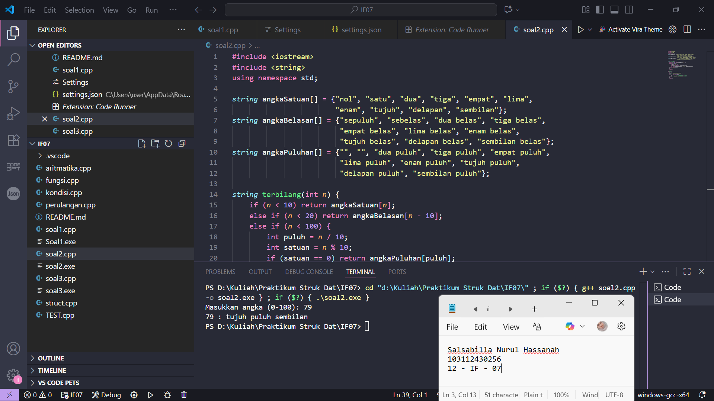
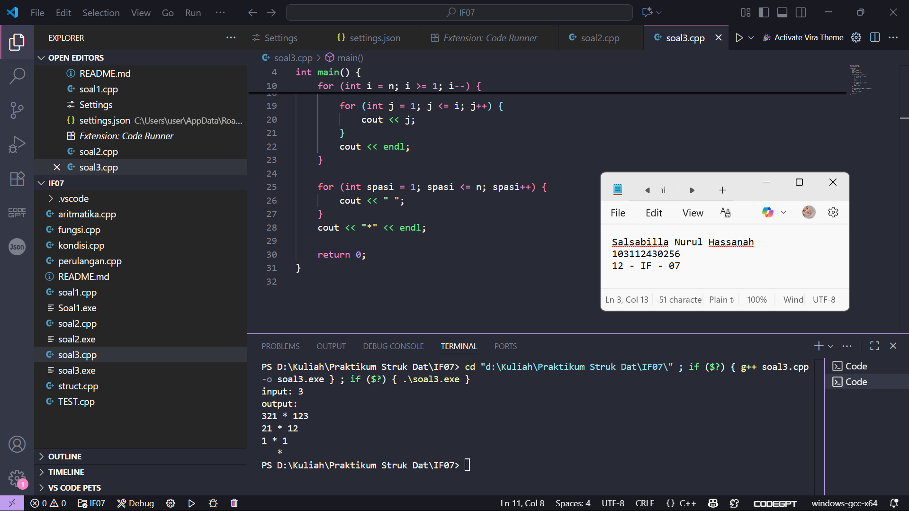

# <h1 align="center">Laporan Praktikum Modul X   Modul 1 Pengenalan C++ </h1>

Salsabilla Nurul Hassanah - 103112430256

## Dasar Teori

Pemrograman dengan C++ merupakan salah satu dasar penting dalam pembelajaran algoritma karena mendukung operasi input, proses, dan output secara terstruktur. Pada soal pertama, konsep yang digunakan adalah tipe data float dan operator aritmatika (+, -, *, /) untuk melakukan perhitungan matematis. Soal kedua menerapkan logika pemetaan (mapping) dan percabangan untuk mengubah angka bulat 0–100 menjadi bentuk teks, yang banyak diaplikasikan pada sistem konversi angka ke tulisan. Sementara itu, soal ketiga melatih pemahaman looping bersarang (nested loop) untuk membentuk pola angka dengan format tertentu. Ketiga latihan ini menunjukkan penerapan dasar teori pemrograman, yaitu bagaimana data dari pengguna diproses melalui algoritma yang sesuai, lalu menghasilkan keluaran yang diharapkan.

## Unguided

### soal 1

aku mengerjakan perulangan

## Unguided

### Soal 1

Buatlah program yang menerima input-an dua buah bilangan bertipe float, kemudian memberikan output-an hasil penjumlahan, pengurangan, perkalian, dan pembagian dari dua bilangan tersebut.

#include <iostream>
using namespace std;

int main() {
    float a, b;
    cout << "Masukkan bilangan pertama: ";
    cin >> a;
    cout << "Masukkan bilangan kedua: ";
    cin >> b;

    cout << "Hasil Penjumlahan: " << a + b << endl;
    cout << "Hasil Pengurangan: " << a - b << endl;
    cout << "Hasil Perkalian: " << a * b << endl;
    if (b != 0)
        cout << "Hasil Pembagian: " << a / b << endl;
    else
        cout << "Pembagian tidak dapat dilakukan (b = 0)" << endl;

    return 0;
}

> Output
> 

Program diminta menampilkan angka menurun dari n ke 1, lalu kembali naik dari 1 ke n. Logikanya kita butuh dua perulangan, yang pertama untuk menghitung mundur dan yang kedua untuk menghitung maju. Pola ini mengajarkan cara menggabungkan dua loop agar hasil keluaran simetris.

### Soal 2

Buatlah sebuah program yang menerima masukan angka dan mengeluarkan output nilai angka tersebut dalam bentuk tulisan. Angka yang akan di-input-kan user adalah bilangan bulat positif mulai dari 0 s.d 100.
Contoh : 79 : tujuh puluh sembilan

#include <iostream>
#include <string>
using namespace std;

string angkaSatuan[] = {"nol", "satu", "dua", "tiga", "empat", "lima", 
                        "enam", "tujuh", "delapan", "sembilan"};
string angkaBelasan[] = {"sepuluh", "sebelas", "dua belas", "tiga belas", 
                         "empat belas", "lima belas", "enam belas", 
                         "tujuh belas", "delapan belas", "sembilan belas"};
string angkaPuluhan[] = {"", "", "dua puluh", "tiga puluh", "empat puluh", 
                         "lima puluh", "enam puluh", "tujuh puluh", 
                         "delapan puluh", "sembilan puluh"};

string terbilang(int n) {
    if (n < 10) return angkaSatuan[n];
    else if (n < 20) return angkaBelasan[n - 10];
    else if (n < 100) {
        int puluh = n / 10;
        int satuan = n % 10;
        if (satuan == 0) return angkaPuluhan[puluh];
        else return angkaPuluhan[puluh] + " " + angkaSatuan[satuan];
    } else if (n == 100) {
        return "seratus";
    }
    return "";
}

int main() {
    int n;
    cout << "Masukkan angka (0-100): ";
    cin >> n;
    if (n >= 0 && n <= 100) {
        cout << n << " : " << terbilang(n) << endl;
    } else {
        cout << "Angka di luar jangkauan!" << endl;
    }
    return 0;
}

> Output
> 

Program membuat pola angka menurun lalu naik sesuai jumlah baris n. Misalnya jika n = 3, maka baris pertama menampilkan 321, baris kedua 21, dan baris terakhir 1. Jadi tiap baris semakin pendek, tetapi tetap mengikuti pola menurun. Tujuan soal ini melatih logika perulangan bersarang untuk mengatur banyaknya angka per baris.

### Soal 3

Buatlah program yang dapat memberikan input dan output sbb.
input : 3
output:
321 * 123
21 * 12
1 * 1
   *

#include <iostream>
using namespace std;

int main() {
    int n;
    cout << "input: ";
    cin >> n;
    cout << "output:\n";

    for (int i = n; i >= 1; i--) {
       
        for (int j = i; j >= 1; j--) {
            cout << j;
        }

        cout << " * ";

        
        for (int j = 1; j <= i; j++) {
            cout << j;
        }
        cout << endl;
    }

    for (int spasi = 1; spasi <= n; spasi++) {
        cout << " ";
    }
    cout << "*" << endl;

    return 0;
}

> Output
> 

Program menampilkan dua deret angka yang dipisahkan tanda *. Deret kiri berisi angka menurun dari n ke 1, sedangkan deret kanan berisi angka menaik dari 1 ke n. Setiap baris angkanya berkurang, sehingga bentuknya seperti segitiga simetris. Di akhir, ada tambahan * di baris paling bawah sebagai penutup pola. Soal ini melatih kombinasi loop menurun, menaik, serta penempatan simbol khusus di tengah.

## Referensi

1. https://en.wikipedia.org/wiki/Data_structure (diakses 28-09-2025)
