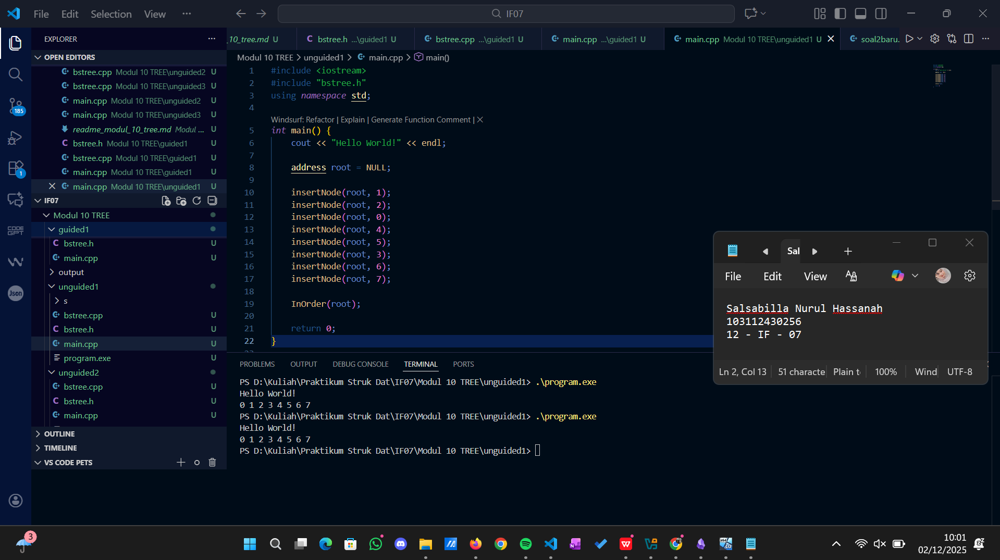
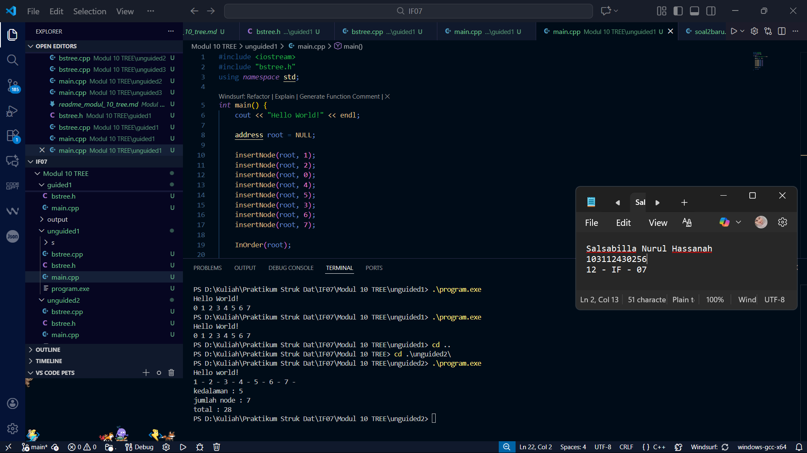

# <h1 align="center">Laporan Praktikum Modul 10 <br> TREE </h1>
<p align="center">Salsabilla Nurul Hassanah - 103112430256</p>

---
## **Dasar Teori**
Tree adalah struktur data non-linear yang terdiri dari node-node yang terhubung secara hierarki. Tree memiliki root, child, leaf, dan subtree. Pada praktikum ini fokus pada Binary Tree dan Binary Search Tree (BST).

### **Binary Tree**
Tree di mana setiap node memiliki maksimal dua anak (left, right).

### **Binary Search Tree (BST)**
BST adalah binary tree terurut:
- Left child < parent
- Right child > parent

Traversal pada tree dilakukan dengan tiga cara: In-order, Pre-order, Post-order.

---

# **Guided 1 – Implementasi ADT BST**
Implementasi Binary Search Tree menggunakan linked list.

### **bstree.h**
```cpp
#ifndef BSTREE_H
#define BSTREE_H

typedef int infotype;

struct Node {
    infotype info;
    Node* left;
    Node* right;
};

typedef Node* address;

address alokasi(infotype x);
void insertNode(address &root, infotype x);
address findNode(address root, infotype x);
void InOrder(address root);

#endif
```

### **bstree.cpp**
```cpp
#include <iostream>
#include "bstree.h"
using namespace std;

address alokasi(infotype x) {
    address p = new Node;
    p->info = x;
    p->left = NULL;
    p->right = NULL;
    return p;
}

void insertNode(address &root, infotype x) {
    if (root == NULL) root = alokasi(x);
    else if (x < root->info) insertNode(root->left, x);
    else if (x > root->info) insertNode(root->right, x);
}

void InOrder(address root) {
    if (root != NULL) {
        InOrder(root->left);
        cout << root->info << " - ";
        InOrder(root->right);
    }
}
```

### **main.cpp**
```cpp
#include <iostream>
#include "bstree.h"
using namespace std;

int main() {
    cout << "Hello World!" << endl;
    address root = NULL;

    insertNode(root, 1);
    insertNode(root, 2);
    insertNode(root, 6);
    insertNode(root, 4);
    insertNode(root, 5);
    insertNode(root, 3);
    insertNode(root, 6);
    insertNode(root, 7);

    InOrder(root);
    return 0;
}
```

### Screenshot Output


### Penjelasan
Program di atas mengimplementasikan Binary Search Tree (BST) dengan fitur lengkap: insert, search, update, dan delete. Setiap data disimpan dalam node yang memiliki pointer ke child kiri dan kanan. Proses insert menempatkan nilai baru sesuai aturan BST—lebih kecil ke kiri, lebih besar ke kanan. Fungsi search menelusuri tree secara rekursif untuk menemukan nilai tertentu. Fungsi update bekerja dengan menghapus nilai lama lalu memasukkan nilai baru. Operasi delete menangani tiga kasus: node tanpa anak, satu anak, atau dua anak (menggunakan pengganti nilai terkecil di subtree kanan). Program juga menyediakan tiga jenis traversal—preorder, inorder, dan postorder—untuk menampilkan isi tree. Pada fungsi main, program menguji semua fitur: memasukkan beberapa angka, menampilkan tree, mencari nilai, mengupdate suatu node, dan menghapus node, lalu menampilkan hasil akhirnya.

---

# **Unguided 1 – Hitung Node, Total, Kedalaman**

### **bstree.h**
```cpp
#ifndef BSTREE_H
#define BSTREE_H

typedef int infotype;

struct Node {
    infotype info;
    Node* left;
    Node* right;
};

typedef Node* address;

address alokasi(infotype x);
void insertNode(address &root, infotype x);
address findNode(address root, infotype x);
void InOrder(address root);

#endif

```

### **bstree.cpp**
```cpp
#include <iostream>
#include "bstree.h"
using namespace std;

// Membuat node baru
address alokasi(infotype x) {
    address p = new Node;
    p->info = x;
    p->left = NULL;
    p->right = NULL;
    return p;
}

// Insert node ke BST
void insertNode(address &root, infotype x) {
    if (root == NULL) {
        root = alokasi(x);
    } 
    else if (x < root->info) {
        insertNode(root->left, x);
    } 
    else if (x > root->info) {
        insertNode(root->right, x);
    }
}

// Mencari node
address findNode(address root, infotype x) {
    if (root == NULL) return NULL;
    if (x == root->info) return root;
    else if (x < root->info) return findNode(root->left, x);
    else return findNode(root->right, x);
}

// Print InOrder
void InOrder(address root) {
    if (root != NULL) {
        InOrder(root->left);
        cout << root->info << " ";
        InOrder(root->right);
    }
}

```

### **main.cpp**
```cpp
#include <iostream>
#include "bstree.h"
using namespace std;

int main() {
    cout << "Hello World!" << endl;

    address root = NULL;

    insertNode(root, 1);
    insertNode(root, 2);
    insertNode(root, 0);
    insertNode(root, 4);
    insertNode(root, 5);
    insertNode(root, 3);
    insertNode(root, 6);
    insertNode(root, 7);

    InOrder(root);

    return 0;
}

```

### Screenshot Output



### Penjelasan
Pada latihan ini kamu diminta memahami bagaimana tree dihitung menggunakan rekursi. Setiap node dihitung dengan menelusuri subtree kiri dan kanan, sehingga total node, total nilai info, dan kedalaman maksimum didapat dari pemanggilan fungsi yang saling bertumpuk. Intinya, tree dibaca seperti menyelam ke setiap cabang terdalam lalu kembali menghitung hasilnya.

# **Unguided 2

### **bstree.h**
```cpp
#ifndef BSTREE_H
#define BSTREE_H

typedef int infotype;

struct Node {
    infotype info;
    Node* left;
    Node* right;
};

typedef Node* address;

address alokasi(infotype x);
void insertNode(address &root, infotype x);
void InOrder(address root);

int hitungNode(address root);
int hitungTotal(address root);
int hitungKedalaman(address root, int start);

#endif

```

### **bstree.cpp**
```cpp
#include <iostream>
#include "bstree.h"
using namespace std;

address alokasi(infotype x) {
    address p = new Node;
    p->info = x;
    p->left = NULL;
    p->right = NULL;
    return p;
}

void insertNode(address &root, infotype x) {
    if (root == NULL) {
        root = alokasi(x);
    }
    else if (x < root->info) {
        insertNode(root->left, x);
    }
    else if (x > root->info) {
        insertNode(root->right, x);
    }
}

void InOrder(address root) {
    if (root != NULL) {
        InOrder(root->left);
        cout << root->info << " - ";
        InOrder(root->right);
    }
}

int hitungNode(address root) {
    if (root == NULL) return 0;
    return 1 + hitungNode(root->left) + hitungNode(root->right);
}

int hitungTotal(address root) {
    if (root == NULL) return 0;
    return root->info + hitungTotal(root->left) + hitungTotal(root->right);
}

int hitungKedalaman(address root, int start) {
    if (root == NULL) return start - 1;  // modul hitung dari 1
    int kiri = hitungKedalaman(root->left, start + 1);
    int kanan = hitungKedalaman(root->right, start + 1);
    return (kiri > kanan ? kiri : kanan);
}


```

### **main.cpp**
```cpp
#include <iostream>
#include "bstree.h"
using namespace std;

int main() {
    cout << "Hello world!" << endl;

    address root = NULL;

    insertNode(root, 1);
    insertNode(root, 2);
    insertNode(root, 6);
    insertNode(root, 4);
    insertNode(root, 5);
    insertNode(root, 3);
    insertNode(root, 6);   
    insertNode(root, 7);

    InOrder(root);
    cout << endl;

    cout << "kedalaman : " << hitungKedalaman(root, 1) << endl;
    cout << "jumlah node : " << hitungNode(root) << endl;
    cout << "total : " << hitungTotal(root) << endl;

    return 0;
}

```

### Screenshot Output



### Penjelasan

Bagian ini melatih kamu memahami cara komputer "membaca" tree dari berbagai sudut. Pre-order membaca node dimulai dari root lalu ke kiri dan kanan, seperti membaca struktur dari atas ke bawah. Post-order membaca anak-anak dulu baru orang tuanya, cocok untuk proses penghapusan. Dengan memahami traversal ini, kamu bisa membayangkan bagaimana pohon diproses secara rekursif.

# **Unguided 3

### **bstree.h**
```cpp
#ifndef BSTREE_H
#define BSTREE_H

typedef int infotype;

struct Node {
    infotype info;
    Node* left;
    Node* right;
};

typedef Node* address;

address alokasi(infotype x);
void insertNode(address &root, infotype x);
void InOrder(address root);
void PreOrder(address root);
void PostOrder(address root);


int hitungNode(address root);
int hitungTotal(address root);
int hitungKedalaman(address root, int start);

#endif

```

### **bstree.cpp**
```cpp
#include <iostream>
#include "bstree.h"
using namespace std;

address alokasi(infotype x) {
    address p = new Node;
    p->info = x;
    p->left = NULL;
    p->right = NULL;
    return p;
}

void insertNode(address &root, infotype x) {
    if (root == NULL) {
        root = alokasi(x);
    }
    else if (x < root->info) {
        insertNode(root->left, x);
    }
    else if (x > root->info) {
        insertNode(root->right, x);
    }
}

void InOrder(address root) {
    if (root != NULL) {
        InOrder(root->left);
        cout << root->info << " - ";
        InOrder(root->right);
    }
}

void PreOrder(address root) {
    if (root != NULL) {
        cout << root->info << " ";
        PreOrder(root->left);
        PreOrder(root->right);
    }
}

void PostOrder(address root) {
    if (root != NULL) {
        PostOrder(root->left);
        PostOrder(root->right);
        cout << root->info << " ";
    }
}


int hitungNode(address root) {
    if (root == NULL) return 0;
    return 1 + hitungNode(root->left) + hitungNode(root->right);
}

int hitungTotal(address root) {
    if (root == NULL) return 0;
    return root->info + hitungTotal(root->left) + hitungTotal(root->right);
}

int hitungKedalaman(address root, int start) {
    if (root == NULL) return start - 1;  // modul hitung dari 1
    int kiri = hitungKedalaman(root->left, start + 1);
    int kanan = hitungKedalaman(root->right, start + 1);
    return (kiri > kanan ? kiri : kanan);
}


```

### **main.cpp**
```cpp
#include <iostream>
#include "bstree.h"
using namespace std;

int main() {
    address root = NULL;

    insertNode(root, 6);
    insertNode(root, 4);
    insertNode(root, 7);
    insertNode(root, 2);
    insertNode(root, 5);
    insertNode(root, 1);
    insertNode(root, 3);

    cout << "Pre-order  : ";
    PreOrder(root);
    cout << endl;

    cout << "Post-order : ";
    PostOrder(root);
    cout << endl;

    return 0;
}

```

### Screenshot Output


### Penjelasan
Unguided ini membantu kamu memahami hubungan antara struktur gambar tree dan output traversal yang dihasilkan. Kamu diminta menghubungkan visualisasi node-node dengan urutan yang dikeluarkan oleh Pre-order dan Post-order. Dengan melihat gambar tree, kamu belajar menerjemahkan struktur visual menjadi alur rekursif yang teratur.

---

# **Referensi**
1. Modul Struktur Data – Modul 10 Tree, Telkom University.
2. Malik D.S., C++ Programming.
3. Goodrich & Tamassia, Data Structures in C++.
4. GeeksForGeeks – Binary Search Tree.
5. TutorialsPoint – Tree Traversal.

