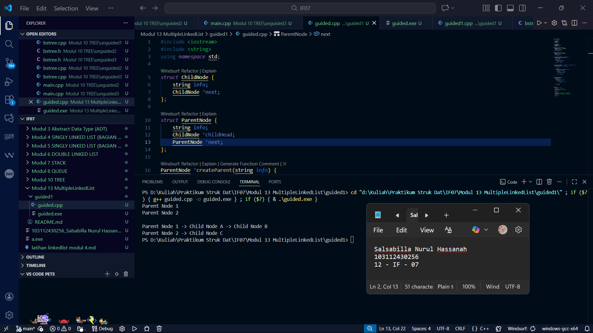
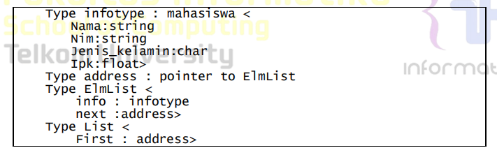
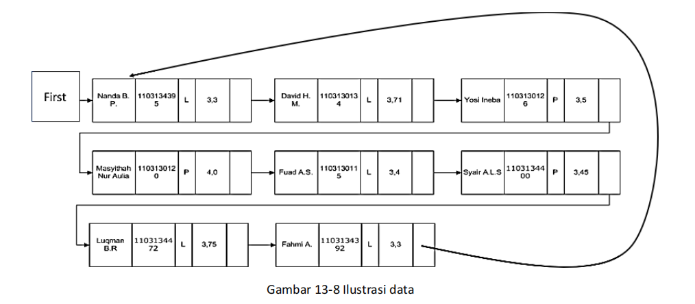
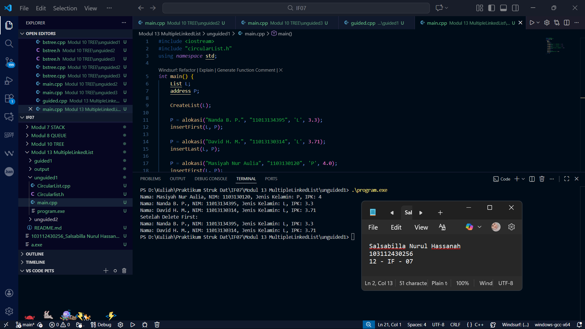
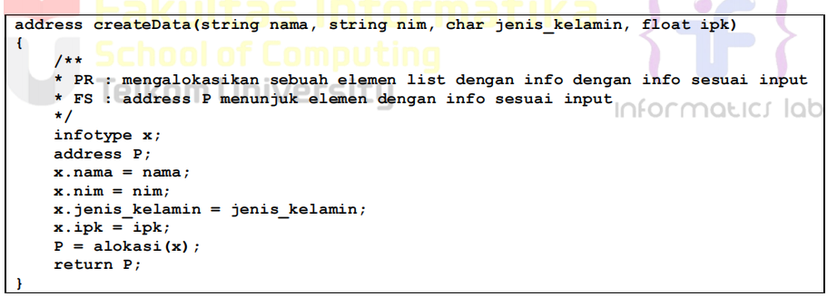
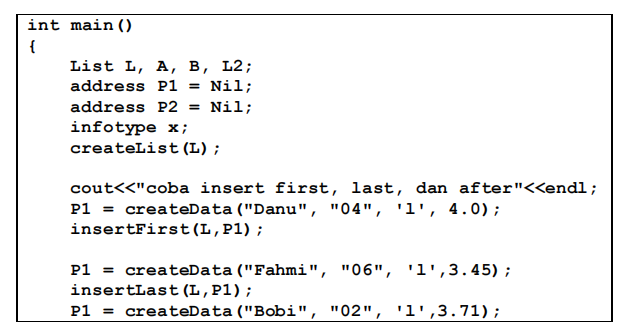
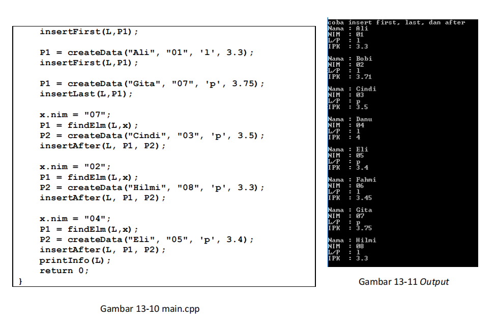
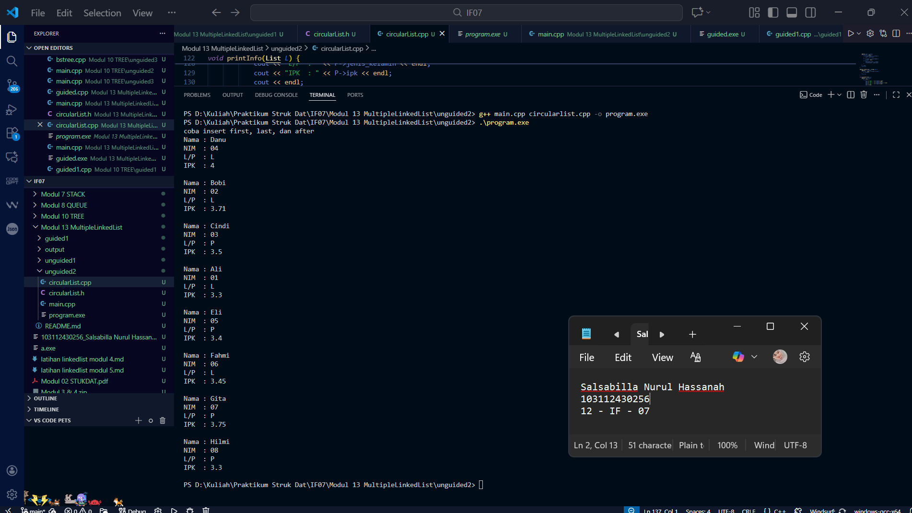

# Laporan Praktikum Modul 13 - Multi Linked List

<p align="center">Salsabilla Nurul Hassanah - 103112430256</p>

---
## Dasar Teori
Multi Linked List merupakan struktur data yang terdiri dari beberapa **list** yang saling terhubung satu sama lain. Setiap elemen dalam Multi Linked List dapat membentuk list sendiri. Biasanya, ada dua jenis list: **list induk** dan **list anak**. List induk dapat menunjuk ke beberapa list anak, dan setiap list anak dapat berisi elemen-elemen yang saling terkait.

### Struktur Multi Linked List
Struktur ini terdiri dari dua jenis list:
1. **List Induk**: Berisi elemen yang menunjuk ke list anak.
2. **List Anak**: Berisi elemen-elemen yang saling terkait dalam list anak.

---
## Guided 1 - Implementasi Multi Linked List

### guided1.cpp
```cpp
#include <iostream>
#include <string>
using namespace std;

struct ChildNode {
    string info;
    ChildNode *next;
};

struct ParentNode {
    string info;
    ChildNode *childHead;
    ParentNode *next;
};

ParentNode *createParent(string info) {
    ParentNode *newNode = new ParentNode;
    newNode->info = info;
    newNode->childHead = NULL;
    newNode->next = NULL;
    return newNode;
}

ChildNode *createChild(string info) {
    ChildNode *newNode = new ChildNode;
    newNode->info = info;
    newNode->next = NULL;
    return newNode;
}

void insertParent(ParentNode *&head, string info) {
    ParentNode *newNode = createParent(info);
    if (head == NULL) {
        head = newNode;
    } else {
        ParentNode *temp = head;
        while (temp->next != NULL) {
            temp = temp->next;
        }
        temp->next = newNode;
    }
}

void insertChild(ParentNode *head, string parentInfo, string childInfo) {
    ParentNode *p = head;
    while (p != NULL && p->info != parentInfo) {
        p = p->next;
    }

    if (p != NULL) {
        ChildNode *newChild = createChild(childInfo);
        if (p->childHead == NULL) {
            p->childHead = newChild;
        } else {
            ChildNode *c = p->childHead;
            while (c->next != NULL) {
                c = c->next;
            }
            c->next = newChild;
        }
    }
}

void printAll(ParentNode *head) {
    ParentNode *p = head;
    while (p != NULL) {
        cout << p->info;
        ChildNode *c = p->childHead;
        if (c != NULL) {
            while (c != NULL) {
                cout << " -> " << c->info;
                c = c->next;
            }
        }
        cout << endl;
        p = p->next;
    }
}

int main() {
    ParentNode *list = NULL;

    insertParent(list, "Parent Node 1");
    insertParent(list, "Parent Node 2");

    printAll(list);
    cout << "\n";

    insertChild(list, "Parent Node 1", "Child Node A");
    insertChild(list, "Parent Node 1", "Child Node B");
    insertChild(list, "Parent Node 2", "Child Node C");

    printAll(list);

    return 0;
}

```

### Screenshot Output



Penjelasan
Program ini mengimplementasikan Multi Linked List dengan dua list utama: list induk dan list anak. Fungsi-fungsi seperti insertFirst(), insertLast(), dan insertAfter() digunakan untuk menambah elemen pada list induk dan anak. Program ini menguji cara menyisipkan elemen pada posisi pertama dan terakhir pada kedua list, serta menampilkan hasilnya.

---
### Unguided 1

1. Perhatikan program 46 multilist.h, buat multilist.cpp untuk implementasi semua fungsi pada
	multilist.h. Buat main.cpp untuk pemanggilan fungsi-fungsi tersebut
2. Buatlah ADT Multi Linked list sebagai berikut di dalam file “circularlist.h”:

Terdapat 11 fungsi/prosedur untuk ADT circularlist
o procedure CreateList( input/output L : List )
o function alokasi( x : infotype ) → address
o procedure dealokasi( input/output t P : address )
o procedure insertFirst( input/output L : List, input P : address ) 
o procedure insertAfter( input/output L : List, input Prec : address, P : address)
o procedure insertLast( input/output L : List, input P : address )
o procedure deleteFirst( input/output L : List, input/output P : address )
o procedure deleteAfter( input/output L : List, input Prec : address, 
 input/output t P : address )
o procedure deleteLast( input/output L : List, P : address )
o function findElm( L : List, x : infotype ) → address 
o procedure printInfo( input L : List )
Keterangan : 
• fungsi findElm mencari elemen di dalam list L berdasarkan nim
o fungsi mengembalikan elemen dengan dengan info nim == x.nim jika ditemukan
STRUKTUR DATA 100
o fungsi mengembalikan NIL jika tidak ditemukan


Circularlist.h
```cpp
#ifndef CIRCULARLIST_H
#define CIRCULARLIST_H

#include <string>
using namespace std;

typedef struct ElmList *address;
typedef struct List {
    address first;
} List;

typedef struct ElmList {
    string nama;
    string nim;
    char jenis_kelamin;
    float ipk;
    address next;
} ElmList;

void CreateList(List &L);
address alokasi(string nama, string nim, char jenis_kelamin, float ipk);
void dealokasi(address P);
void insertFirst(List &L, address P);
void insertAfter(List &L, address P, address Prec);
void insertLast(List &L, address P);
void deleteFirst(List &L, address &P);
void deleteAfter(List &L, address &P, address Prec);
void deleteLast(List &L, address &P);
address findElm(List L, string nim);
void printInfo(List L);

#endif

```

Circularlist.cpp
```cpp
#include "circularList.h"
#include <iostream>
using namespace std;

void CreateList(List &L) {
    L.first = NULL;
}

address alokasi(string nama, string nim, char jenis_kelamin, float ipk) {
    address P = new ElmList;
    P->nama = nama;
    P->nim = nim;
    P->jenis_kelamin = jenis_kelamin;
    P->ipk = ipk;
    P->next = NULL;
    return P;
}

void dealokasi(address P) {
    delete P;
}

void insertFirst(List &L, address P) {
  if (L.first == NULL) {
        L.first = P;
        P->next = L.first;
    } else {
        address last = L.first;
        while (last->next != L.first) {
            last = last->next;
        }
        last->next = P;
        P->next = L.first;
        L.first = P;
    }
}

void insertAfter(List &L, address P, address Prec) {
    P->next = Prec->next;
    Prec->next = P;
}

void insertLast(List &L, address P) {
    if (L.first == NULL) {
        L.first = P;
        P->next = L.first;
    } else {
        address last = L.first;
        while (last->next != L.first) {
            last = last->next;
        }
        last->next = P;
        P->next = L.first;
    }
}

void deleteFirst(List &L, address &P) {
    if (L.first == NULL) {
        P = NULL;
    } else {
        P = L.first;
        address last = L.first;
        while (last->next != L.first) {
            last = last->next;
        }
        if (L.first == L.first->next) {
            L.first = NULL;
        } else {
            L.first = L.first->next;
            last->next = L.first;
        }
    }
}

void deleteAfter(List &L, address &P, address Prec) {
    P = Prec->next;
    Prec->next = P->next;
    P->next = NULL;
}

void deleteLast(List &L, address &P) {
    address last = L.first;
    address beforeLast;
    if (L.first != NULL) {
        while (last->next != L.first) {
            beforeLast = last;
            last = last->next;
        }
        if (L.first == L.first->next) {
            L.first = NULL;
        } else {
            beforeLast->next = L.first;
        }
    }
    P = last;
    delete P;
}

address findElm(List L, string nim) {
    address P = L.first;
    while (P != NULL && P->nim != nim) {
        P = P->next;
    }
    return P;
}

void printInfo(List L) {
    address P = L.first;
    if (P != NULL) {
        do {
            cout << "Nama: " << P->nama << ", NIM: " << P->nim << ", Jenis Kelamin: " 
            << P->jenis_kelamin << ", IPK: " << P->ipk << endl;
            P = P->next;
        } while (P != L.first);
    } else {
        cout << "List Kosong!" << endl;
    }
}
```

main.cpp
```cpp
#include <iostream>
#include "circularList.h"
using namespace std;

int main() {
    List L;
    address P;
    
    CreateList(L);

    P = alokasi("Nanda B. P.", "11013134395", 'L', 3.3);
    insertFirst(L, P);
    
    P = alokasi("David H. M.", "11013130314", 'L', 3.71);
    insertLast(L, P);
    
    P = alokasi("Masiyah Nur Aulia", "1103130120", 'P', 4.0);
    insertFirst(L, P);
    
    printInfo(L);

    deleteFirst(L, P);
    cout << "Setelah Delete First:" << endl;
    printInfo(L);

    return 0;
}

```

#### Screenshot Output



### Penjelasan
Pada Unguided 1, praktikum ini berfokus pada implementasi Multi Linked List dalam struktur data. Multi Linked List menggabungkan lebih dari satu list yang saling terhubung satu sama lain, dengan list induk yang menunjuk ke list anak. Praktikum ini menguji pemahaman tentang cara menambah (insert) dan menghapus (delete) elemen dalam list induk dan list anak, serta bagaimana mencari dan menampilkan elemen berdasarkan kriteria tertentu. Dalam implementasinya, fungsi-fungsi seperti insertFirst, insertLast, dan insertAfter digunakan untuk menambah elemen pada posisi tertentu, sementara findElm dan deleteFirst digunakan untuk mencari dan menghapus elemen. Tujuan dari praktikum ini adalah agar mahasiswa dapat memahami konsep dasar Multi Linked List serta dapat mengimplementasikannya dengan benar melalui kode yang diberikan.

---
### Unguided 2
Buatlah implementasi ADT Doubly Linked list pada file “circularlist.cpp”. Tambahkan fungsi/prosedur 
berikut pada file “main.cpp”.
• fungsi create ( in nama, nim : string, jenis_kelamin : char, ipk : float)
o fungsi disediakan, ketik ulang code yang diberikan
o fungsi mengalokasikan sebuah elemen list dengan info sesuai input

Cobalah hasil implementasi ADT pada file “main.cpp"



circularlist.h
```cpp
#ifndef CIRCULARLIST_H
#define CIRCULARLIST_H

#include <string>
using namespace std;

typedef struct ElmList *address;
typedef struct List {
    address first;
} List;

typedef struct ElmList {
    string nama;
    string nim;
    char jenis_kelamin;
    float ipk;
    address next;
    address prev;
} ElmList;

void CreateList(List &L);
address alokasi(string nama, string nim, char jenis_kelamin, float ipk);
void dealokasi(address P);
void insertFirst(List &L, address P);
void insertAfter(List &L, address P, address Prec);
void insertLast(List &L, address P);
void deleteFirst(List &L, address &P);
void deleteAfter(List &L, address &P, address Prec);
void deleteLast(List &L, address &P);
address findElm(List L, string nim);
void printInfo(List L);

#endif
```

circularlist.cpp
```cpp
#include "circularList.h"
#include <iostream>
using namespace std;

void CreateList(List &L) {
    L.first = NULL;
}

address alokasi(string nama, string nim, char jenis_kelamin, float ipk) {
    address P = new ElmList;
    P->nama = nama;
    P->nim = nim;
    P->jenis_kelamin = jenis_kelamin;
    P->ipk = ipk;
    P->next = NULL;
    P->prev = NULL;
    return P;
}

void dealokasi(address P) {
    delete P;
}

void insertFirst(List &L, address P) {
    if (L.first == NULL) {
        L.first = P;
        P->next = L.first;
        P->prev = L.first;
    } else {
        address last = L.first;
        while (last->next != L.first) {
            last = last->next;
        }
        last->next = P;
        P->prev = last;
        P->next = L.first;
        L.first->prev = P;
        L.first = P;
    }
}

void insertAfter(List &L, address P, address Prec) {
    P->next = Prec->next;
    Prec->next = P;
    P->prev = Prec;
    if (P->next != NULL) {
        P->next->prev = P;
    }
}

void insertLast(List &L, address P) {
    if (L.first == NULL) {
        L.first = P;
        P->next = L.first;
        P->prev = L.first;
    } else {
        address last = L.first;
        while (last->next != L.first) {
            last = last->next;
        }
        last->next = P;
        P->prev = last;
        P->next = L.first;
        L.first->prev = P;
    }
}

void deleteFirst(List &L, address &P) {
    if (L.first == NULL) {
        P = NULL;
    } else {
        P = L.first;
        address last = L.first;
        while (last->next != L.first) {
            last = last->next;
        }
        if (L.first == L.first->next) {
            L.first = NULL;
        } else {
            L.first = L.first->next;
            last->next = L.first;
            L.first->prev = last;
        }
    }
}

void deleteAfter(List &L, address &P, address Prec) {
    P = Prec->next;
    Prec->next = P->next;
    if (P->next != NULL) {
        P->next->prev = Prec;
    }
    P->next = NULL;
    P->prev = NULL;
}

void deleteLast(List &L, address &P) {
    address last = L.first;
    if (L.first != NULL) {
        while (last->next != L.first) {
            last = last->next;
        }
        if (L.first == L.first->next) {
            L.first = NULL;
        } else {
            last->prev->next = L.first;
            L.first->prev = last->prev;
        }
    }
    P = last;
    delete P;
}

address findElm(List L, string nim) {
    address P = L.first;
    while (P != NULL && P->nim != nim) {
        P = P->next;
    }
    return P;
}

void printInfo(List L) {
    address P = L.first;
    if (P != NULL) {
        do {
            cout << "Nama : " << P->nama << endl;
            cout << "NIM  : " << P->nim << endl;
            cout << "L/P  : " << P->jenis_kelamin << endl;
            cout << "IPK  : " << P->ipk << endl;
            cout << endl;
            P = P->next;
        } while (P != L.first);
    } else {
        cout << "List Kosong!" << endl;
    }
}

```

main.cpp
```cpp
#include <iostream>
#include "circularList.h"
using namespace std;

int main() {
    List L;
    address P;

    CreateList(L);

    P = alokasi("Danu", "04", 'L', 4.0);
    insertFirst(L, P);  
    P = alokasi("Ali", "01", 'L', 3.3);
    insertLast(L, P);  
    P = alokasi("Cindi", "03", 'P', 3.5);
    insertAfter(L, P, L.first);  
    P = alokasi("Bobi", "02", 'L', 3.71);
    insertAfter(L, P, L.first); 
    P = alokasi("Eli", "05", 'P', 3.4);
    insertLast(L, P);  
    P = alokasi("Fahmi", "06", 'L', 3.45);
    insertLast(L, P);  
    P = alokasi("Gita", "07", 'P', 3.75);
    insertLast(L, P);  
    P = alokasi("Hilmi", "08", 'P', 3.3);
    insertLast(L, P);  

    cout << "coba insert first, last, dan after" << endl;
    printInfo(L);  

    return 0;
}
```

### Screenshot Output


### Penjelasan
Pada Unguided 2, praktikum ini menantang mahasiswa untuk mengimplementasikan operasi-operasi dasar dalam Circular Doubly Linked List, di mana setiap elemen memiliki pointer ke elemen sebelumnya dan setelahnya, serta juga menunjuk kembali ke elemen pertama untuk membentuk struktur sirkular. Praktikum ini mengharuskan mahasiswa untuk memahami cara menyisipkan elemen pada awal (insertFirst), setelah elemen tertentu (insertAfter), dan di akhir list (insertLast), serta cara menghapus elemen dari posisi yang berbeda (deleteFirst, deleteLast, deleteAfter). Fungsi findElm digunakan untuk mencari elemen berdasarkan kriteria tertentu (seperti nim), dan printInfo digunakan untuk menampilkan informasi semua elemen yang ada dalam list. Tujuan dari praktikum ini adalah untuk memberikan pemahaman mendalam tentang penggunaan Circular Doubly Linked List serta implementasi fungsi-fungsi yang memanipulasi elemen dalam struktur tersebut.

---
# Referensi
1. Modul Struktur Data – Modul 13 Multi Linked List, Telkom University.
2. "Data Structures and Algorithms in C++" by Adam Drozdek.
3. GeeksForGeeks – Multi Linked List.
4. TutorialsPoint – Linked List Traversal.