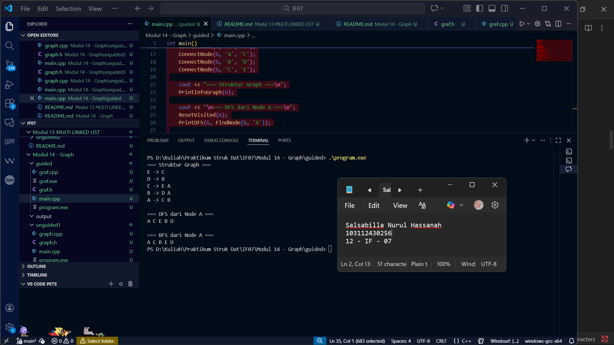
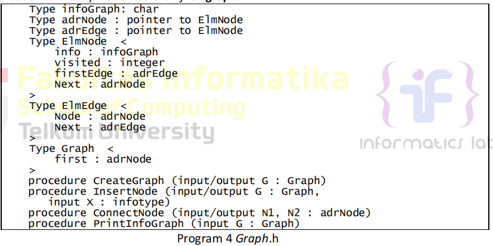
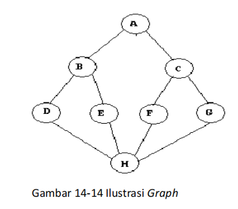
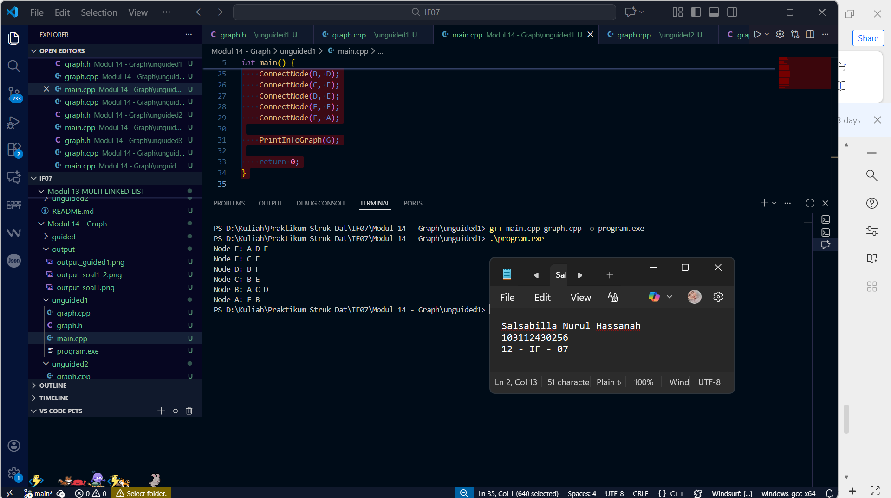
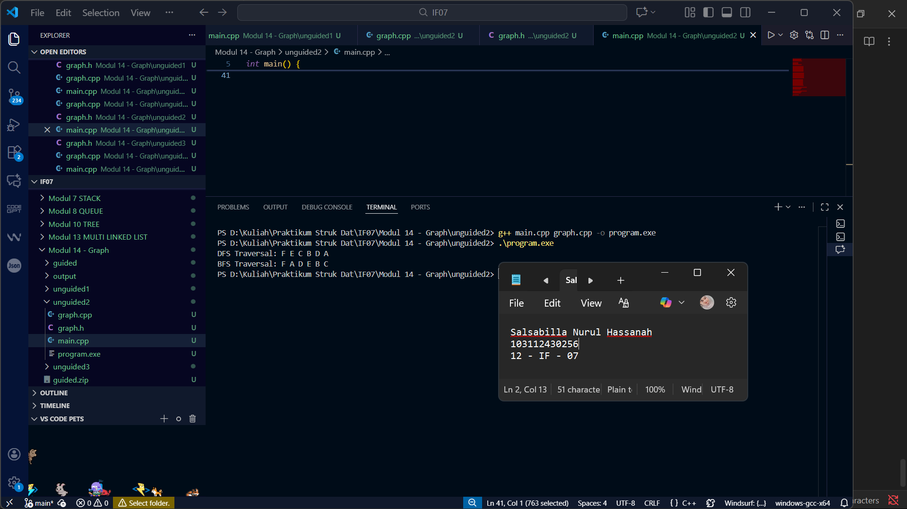
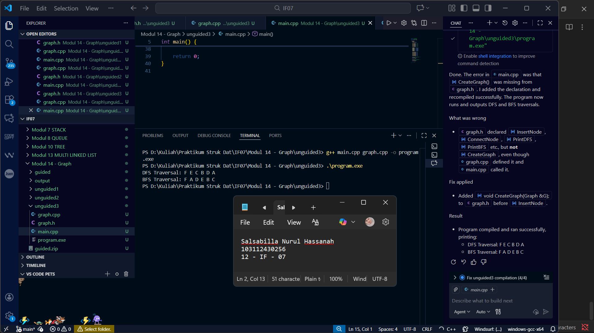

# Laporan Praktikum Modul 14 - Graph

<p align="center">Salsabilla Nurul Hassanah - 103112430256</p>

---
## Dasar Teori

Graph adalah struktur data yang terdiri dari dua komponen utama, yaitu **node** (atau biasa disebut juga sebagai **vertex**) dan **edge** (atau **sisi**) yang menghubungkan node-node tersebut. Dalam graf, **node** mewakili entitas atau objek yang ingin dianalisis, sementara **edge** menggambarkan hubungan atau koneksi antara dua node. Graph dapat digunakan untuk berbagai aplikasi, termasuk dalam pemrograman komputer, jaringan sosial, pemetaan, dan bahkan dalam perencanaan rute atau transportasi.

Terdapat dua jenis graph yang umum digunakan:

1. **Graph Berarah (Directed Graph)**: Dalam graph berarah, setiap **edge** memiliki arah yang jelas dari satu **node** ke **node** lainnya. Artinya, jika ada hubungan antara node A dan node B, maka hanya node A yang mengarah ke node B, dan sebaliknya tidak berlaku kecuali ada edge terpisah dari B ke A. Graph berarah sering digunakan dalam masalah yang melibatkan urutan atau ketergantungan, seperti perencanaan proyek atau representasi struktur organisasi.
    
2. **Graph Tidak Berarah (Undirected Graph)**: Berbeda dengan graph berarah, dalam **graph tidak berarah**, **edge** tidak memiliki arah. Artinya, jika node A terhubung ke node B, maka node B juga secara otomatis terhubung ke node A. Graph jenis ini sering digunakan untuk menggambarkan hubungan yang tidak memiliki arah spesifik, seperti dalam jaringan sosial, di mana dua orang yang saling berteman dapat dianggap memiliki hubungan yang saling menghubungkan.
    

Graph dapat direpresentasikan dengan berbagai metode, salah satunya adalah menggunakan **adjacency matrix** atau **adjacency list**. Pada **adjacency matrix**, graph direpresentasikan dalam bentuk matriks persegi yang menunjukkan apakah dua node terhubung atau tidak. Pada **adjacency list**, setiap node disimpan bersama dengan daftar node-node yang terhubung dengannya, yang lebih efisien dalam hal penggunaan ruang memori untuk graph yang jarang (sparse graph).

Selain itu, dalam graf yang lebih kompleks, sering kali perlu dilakukan **penelusuran** atau **traversal** untuk mengunjungi node-node dalam urutan tertentu. Ada dua teknik utama yang digunakan untuk traversal:

1. **Depth First Search (DFS)**: Dalam DFS, traversal dilakukan dengan mengeksplorasi sebanyak mungkin cabang dari node sebelum kembali. DFS dapat dilakukan secara rekursif atau dengan menggunakan **stack** untuk melacak node yang harus dikunjungi.
    
2. **Breadth First Search (BFS)**: BFS berbeda dengan DFS karena traversal dilakukan level per level, mulai dari node awal dan kemudian mengunjungi node-node tetangga secara berurutan. BFS menggunakan **queue** untuk mengantri node yang akan dikunjungi.
    

Kedua teknik ini sangat penting dalam berbagai algoritma graf, seperti pencarian jalur terpendek, penentuan keterhubungan antar node, atau untuk menentukan siklus dalam graph. Meskipun **DFS** lebih efisien dalam menemukan komponen terhubung dalam graph yang dalam, **BFS** sering digunakan ketika kita mencari jalur terpendek antar dua node dalam graph yang tidak berbobot.

Dalam praktikum ini, kita akan fokus pada pengimplementasian graph menggunakan **multilist**. **Multilist** memungkinkan representasi graph dengan menggunakan linked list, di mana setiap node terhubung ke satu atau lebih node lainnya. Ini memberikan keuntungan dalam hal fleksibilitas dan efisiensi, karena node dan edge dapat dengan mudah diubah, ditambah, atau dihapus tanpa memerlukan struktur data statis seperti adjacency matrix. Dengan menggunakan multilist, kita dapat mengimplementasikan **DFS** dan **BFS** untuk menelusuri graph yang telah dibangun.

Selain itu, dalam **graph berarah**, kita dapat memanfaatkan **Topological Sorting** untuk mengurutkan node dalam urutan linear berdasarkan ketergantungannya. Topological sorting banyak digunakan dalam aplikasi yang melibatkan urutan, seperti dalam penjadwalan tugas atau kompilasi kode.

---
## Guided 1 - Implementasi Multi Linked List

### graf.h
```cpp
#ifndef GRAF_H_INCLUDED
#define GRAF_H_INCLUDED

#include <iostream>
using namespace std;

typedef char infoGraph;

struct ElmNode;
struct ElmEdge;

typedef ElmNode *adrNode;
typedef ElmEdge *adrEdge;

struct ElmNode
{
    infoGraph info;
    int visited;
    adrEdge firstEdge;
    adrNode next;
};

struct ElmEdge
{
    adrNode node;
    adrEdge next;
};

struct Graph
{
    adrNode first;
};

void CreateGraph(Graph &G);
adrNode AllocateNode(infoGraph X);
adrEdge AllocateEdge(adrNode N);

void InsertNode(Graph &G, infoGraph X);
adrNode FindNode(Graph G, infoGraph X);

void ConnectNode(Graph &G, infoGraph A, infoGraph B);

void PrintInfoGraph(Graph G);

void ResetVisited(Graph &G);
void PrintDFS(Graph &G, adrNode N);
void PrintBFS(Graph &G, adrNode N);

#endif


```

### graf.cpp
```cpp
#include "graf.h"
#include <queue>
#include <stack>

void CreateGraph(Graph &G)
{
    G.first = NULL;
}

adrNode AllocateNode(infoGraph X)
{
    adrNode P = new ElmNode;
    P->info = X;
    P->visited = 0;
    P->firstEdge = NULL;
    P->next = NULL;
    return P;
}

adrEdge AllocateEdge(adrNode N)
{
    adrEdge P = new ElmEdge;
    P->node = N;
    P->next = NULL;
    return P;
}

void InsertNode(Graph &G, infoGraph X)
{
    adrNode P = AllocateNode(X);
    P->next = G.first;
    G.first = P;
}

adrNode FindNode(Graph G, infoGraph X)
{
    adrNode P = G.first;
    while (P != NULL)
    {
        if (P->info == X)
            return P;
        P = P->next;
    }
    return NULL;
}

void ConnectNode(Graph &G, infoGraph A, infoGraph B)
{
    adrNode N1 = FindNode(G, A);
    adrNode N2 = FindNode(G, B);

    if (N1 == NULL || N2 == NULL)
    {
        cout << "Node tidak ditemukan!\n";
        return;
    }

    adrEdge E1 = AllocateEdge(N2);
    E1->next = N1->firstEdge;
    N1->firstEdge = E1;

    adrEdge E2 = AllocateEdge(N1);
    E2->next = N2->firstEdge;
    N2->firstEdge = E2;
}

void PrintInfoGraph(Graph G)
{
    adrNode P = G.first;
    while (P != NULL)
    {
        cout << P->info << " -> ";
        adrEdge E = P->firstEdge;
        while (E != NULL)
        {
            cout << E->node->info << " ";
            E = E->next;
        }
        cout << endl;
        P = P->next;
    }
}

void ResetVisited(Graph &G)
{
    adrNode P = G.first;
    while (P != NULL)
    {
        P->visited = 0;
        P = P->next;
    }
}

void PrintDFS(Graph &G, adrNode N)
{
    if (N == NULL)
        return;

    N->visited = 1;
    cout << N->info << " ";

    adrEdge E = N->firstEdge;
    while (E != NULL)
    {
        if (E->node->visited == 0)
        {
            PrintDFS(G, E->node);
        }
        E = E->next;
    }
}

void PrintBFS(Graph &G, adrNode N)
{
    if (N == NULL)
        return;

    queue<adrNode> Q;
    Q.push(N);

    while (!Q.empty())
    {
        adrNode curr = Q.front();
        Q.pop();

        if (curr->visited == 0)
        {
            curr->visited = 1;
            cout << curr->info << " ";

            adrEdge E = curr->firstEdge;
            while (E != NULL)
            {
                if (E->node->visited == 0)
                {
                    Q.push(E->node);
                }
                E = E->next;
            }
        }
    }
}


```

### main.cpp
```cpp
#include "graf.h"
#include <iostream>
using namespace std;

int main()
{
    Graph G;
    CreateGraph(G);

    InsertNode(G, 'A');
    InsertNode(G, 'B');
    InsertNode(G, 'C');
    InsertNode(G, 'D');
    InsertNode(G, 'E');

    ConnectNode(G, 'A', 'B');
    ConnectNode(G, 'A', 'C');
    ConnectNode(G, 'B', 'D');
    ConnectNode(G, 'C', 'E');

    cout << "=== Struktur Graph ===\n";
    PrintInfoGraph(G);

    cout << "\n=== DFS dari Node A ===\n";
    ResetVisited(G);
    PrintDFS(G, FindNode(G, 'A'));

    cout << "\n\n=== BFS dari Node A ===\n";
    ResetVisited(G);
    PrintBFS(G, FindNode(G, 'A'));

    cout << endl;
    return 0;
}


```

### Screenshot Output



Penjelasan
Pada Guided 1, kita mengimplementasikan struktur graph menggunakan multilist, di mana setiap node dapat memiliki daftar edge yang menghubungkannya dengan node lain. Fungsi-fungsi yang digunakan antara lain InsertNode untuk menambahkan node baru ke dalam graph, ConnectNode untuk menghubungkan dua node dengan edge, dan PrintInfoGraph untuk menampilkan struktur graph. Implementasi Depth First Search (DFS) dan Breadth First Search (BFS) juga diperkenalkan untuk penelusuran graph. Dalam hal ini, DFS mengeksplorasi graph secara mendalam, sementara BFS mengeksplorasi level per level menggunakan stack dan queue, masing-masing.

---
### Unguided 1

1. Buatlah ADT Graph tidak berarah file “graph.h”:

Buatlah implementasi ADT Graph pada file “graph.cpp” dan cobalah hasil implementasi ADT 
pada file “main.cpp”.



graph.h
```cpp
#ifndef GRAPH_H_INCLUDE
#define GRAPH_H_INCLUDE

typedef char infoGraph;
typedef struct ElmNode *adrNode;
typedef struct ElmEdge *adrEdge;

struct ElmNode {
    infoGraph info;
    int visited;
    adrEdge firstEdge;
    adrNode Next;
};

struct ElmEdge {
    adrNode Node;
    adrEdge Next;
};

struct Graph {
    adrNode First;
};

void CreateGraph(Graph &G); 
void InsertNode(Graph &G, infoGraph X); 
void ConnectNode(adrNode N1, adrNode N2); 
void PrintInfoGraph(Graph G); 

#endif

```

graph.cpp
```cpp
#include "graph.h"
#include <iostream>
using namespace std;

void CreateGraph(Graph &G) {
    G.First = nullptr; 
}

void InsertNode(Graph &G, infoGraph X) {
    adrNode newNode = new ElmNode;
    newNode->info = X;
    newNode->visited = 0; 
    newNode->firstEdge = nullptr; 
    newNode->Next = G.First;
    G.First = newNode;
}

void ConnectNode(adrNode N1, adrNode N2) {
    adrEdge newEdge = new ElmEdge;
    newEdge->Node = N2;
    newEdge->Next = N1->firstEdge;
    N1->firstEdge = newEdge; 

    newEdge = new ElmEdge;
    newEdge->Node = N1;
    newEdge->Next = N2->firstEdge;
    N2->firstEdge = newEdge;
}

void PrintInfoGraph(Graph G) {
    adrNode temp = G.First;
    while (temp != nullptr) {
        cout << "Node " << temp->info << ": ";
        adrEdge edge = temp->firstEdge;
        while (edge != nullptr) {
            cout << edge->Node->info << " ";
            edge = edge->Next;
        }
        cout << endl;
        temp = temp->Next;
    }
}
```

main.cpp
```cpp
#include <iostream>
#include "graph.h"
using namespace std;

int main() {
    Graph G;
    CreateGraph(G);

    InsertNode(G, 'A');
    InsertNode(G, 'B');
    InsertNode(G, 'C');
    InsertNode(G, 'D');
    InsertNode(G, 'E');
    InsertNode(G, 'F');

    adrNode A = G.First;
    adrNode B = A->Next;
    adrNode C = B->Next;
    adrNode D = C->Next;
    adrNode E = D->Next;
    adrNode F = E->Next;

    ConnectNode(A, B);
    ConnectNode(A, C);
    ConnectNode(B, D);
    ConnectNode(C, E);
    ConnectNode(D, E);
    ConnectNode(E, F);
    ConnectNode(F, A);

    PrintInfoGraph(G);

    return 0;
}


```

#### Screenshot Output



### Penjelasan
Pada Unguided 1, tugasnya adalah mengimplementasikan DFS pada graph tidak berarah. Dalam implementasi ini, kita menggunakan stack untuk menelusuri node-node graph secara mendalam (depth-first). Fungsi DFS akan memulai dari node yang ditentukan, kemudian mengunjungi semua node yang terhubung dengan node tersebut yang belum dikunjungi. Proses ini berlanjut hingga semua node dalam graph terkunjungi. Setiap node yang dikunjungi akan ditandai sebagai visited untuk mencegah kunjungan ganda. Hasilnya adalah urutan traversal dari node yang dijelajahi.

---
### Unguided 2
Buatlah prosedur untuk menampilkanhasil penelusuran DFS.
STRUKTUR DATA 111
prosedur PrintDFS (Graph G, adrNode N);

graph.h
```cpp
#ifndef GRAPH_H_INCLUDE
#define GRAPH_H_INCLUDE

typedef char infoGraph; 
typedef struct ElmNode *adrNode;
typedef struct ElmEdge *adrEdge;

struct ElmNode {
    infoGraph info;
    int visited;
    adrEdge firstEdge;
    adrNode Next;
};

struct ElmEdge {
    adrNode Node;
    adrEdge Next;
};

struct Graph {
    adrNode First;
};

void CreateGraph(Graph &G); 
void InsertNode(Graph &G, infoGraph X); 
void ConnectNode(adrNode N1, adrNode N2);
void PrintInfoGraph(Graph G); 
void PrintDFS(Graph G, adrNode start); 
void PrintBFS(Graph G, adrNode start); 

#endif

```

graph.cpp
```cpp
#include "graph.h"
#include <iostream>
#include <stack>
#include <queue>
using namespace std;

void CreateGraph(Graph &G) {
    G.First = nullptr; // Inisialisasi graph kosong
}

void InsertNode(Graph &G, infoGraph X) {
    adrNode newNode = new ElmNode;
    newNode->info = X;
    newNode->visited = 0; // Node belum dikunjungi
    newNode->firstEdge = nullptr; // Tidak ada edge
    newNode->Next = G.First;
    G.First = newNode; // Menambahkan node ke graph
}

void ConnectNode(adrNode N1, adrNode N2) {
    adrEdge newEdge = new ElmEdge;
    newEdge->Node = N2;
    newEdge->Next = N1->firstEdge;
    N1->firstEdge = newEdge; // Menambahkan edge dari N1 ke N2

    // Karena ini graph tidak berarah, tambahkan juga edge dari N2 ke N1
    newEdge = new ElmEdge;
    newEdge->Node = N1;
    newEdge->Next = N2->firstEdge;
    N2->firstEdge = newEdge;
}

void PrintInfoGraph(Graph G) {
    adrNode temp = G.First;
    while (temp != nullptr) {
        cout << "Node " << temp->info << ": ";
        adrEdge edge = temp->firstEdge;
        while (edge != nullptr) {
            cout << edge->Node->info << " ";
            edge = edge->Next;
        }
        cout << endl;
        temp = temp->Next;
    }
}

void DFS(adrNode node) {
    
    stack<adrNode> S;
    node->visited = 1; 
    S.push(node);

    while (!S.empty()) {
        adrNode current = S.top();
        S.pop();
        cout << current->info << " ";

        adrEdge edge = current->firstEdge;
        while (edge != nullptr) {
            if (edge->Node->visited == 0) {
                edge->Node->visited = 1; 
                S.push(edge->Node); 
            }
            edge = edge->Next;
        }
    }
}

void PrintDFS(Graph G, adrNode start) {

    adrNode temp = G.First;
    while (temp != nullptr) {
        temp->visited = 0;
        temp = temp->Next;
    }
   
    DFS(start);
}

void BFS(adrNode start) {
   
    queue<adrNode> Q;
    start->visited = 1; 
    Q.push(start); 

    while (!Q.empty()) {
        adrNode current = Q.front();
        Q.pop();
        cout << current->info << " "; 

        adrEdge edge = current->firstEdge;
        while (edge != nullptr) {
            if (edge->Node->visited == 0) {
                edge->Node->visited = 1;
                Q.push(edge->Node); 
            }
            edge = edge->Next;
        }
    }
}

void PrintBFS(Graph G, adrNode start) {

    adrNode temp = G.First;
    while (temp != nullptr) {
        temp->visited = 0;
        temp = temp->Next;
    }

    BFS(start);
}

```

main.cpp
```cpp
#include <iostream>
#include "graph.h"
using namespace std;

int main() {
    Graph G;
    CreateGraph(G);

    InsertNode(G, 'A');
    InsertNode(G, 'B');
    InsertNode(G, 'C');
    InsertNode(G, 'D');
    InsertNode(G, 'E');
    InsertNode(G, 'F');

    adrNode A = G.First;
    adrNode B = A->Next;
    adrNode C = B->Next;
    adrNode D = C->Next;
    adrNode E = D->Next;
    adrNode F = E->Next;

    ConnectNode(A, B);
    ConnectNode(A, C);
    ConnectNode(B, D);
    ConnectNode(C, E);
    ConnectNode(D, E);
    ConnectNode(E, F);
    ConnectNode(F, A); 

    cout << "DFS Traversal: ";
    PrintDFS(G, A);
    cout << endl;

    cout << "BFS Traversal: ";
    PrintBFS(G, A);
    cout << endl;

    return 0;
}

```

### Screenshot Output


### Penjelasan
Pada Unguided 2, kita diminta untuk menerapkan DFS menggunakan pendekatan rekursif. DFS rekursif bekerja dengan cara memanggil fungsi yang sama untuk setiap node yang terhubung, menelusuri graph hingga tidak ada node lagi yang dapat dikunjungi. Pendekatan rekursif lebih sederhana dan efisien dalam penulisan kode karena tidak memerlukan struktur stack eksplisit seperti pada DFS iteratif. Namun, rekursi tetap membutuhkan pengelolaan status visited agar traversal tidak mengunjungi node yang sama lebih dari sekali.

---

### Unguided 3
Buatlah prosedur untuk menampilkanhasil penelusuran DFS.
prosedur PrintBFS (Graph G, adrNode N);

graph.h
```cpp
#ifndef GRAPH_H_INCLUDE
#define GRAPH_H_INCLUDE

typedef char infoGraph; 
typedef struct ElmNode *adrNode;
typedef struct ElmEdge *adrEdge;

struct ElmNode {
    infoGraph info;
    int visited;
    adrEdge firstEdge;
    adrNode Next;
};

struct ElmEdge {
    adrNode Node;
    adrEdge Next;
};

struct Graph {
    adrNode First;
};

void CreateGraph(Graph &G); 
void InsertNode(Graph &G, infoGraph X); 
void ConnectNode(adrNode N1, adrNode N2);
void PrintInfoGraph(Graph G); 
void PrintDFS(Graph G, adrNode start); 
void PrintBFS(Graph G, adrNode start); 

#endif

```

graph.cpp
```cpp
#include "graph.h"
#include <iostream>
#include <stack>
#include <queue>
using namespace std;

void CreateGraph(Graph &G) {
    G.First = nullptr;  
}

void InsertNode(Graph &G, infoGraph X) {
    adrNode newNode = new ElmNode;
    newNode->info = X;
    newNode->visited = 0; 
    newNode->firstEdge = nullptr; 
    newNode->Next = G.First;
    G.First = newNode;
}

void ConnectNode(adrNode N1, adrNode N2) {

    adrEdge newEdge = new ElmEdge;
    newEdge->Node = N2;
    newEdge->Next = N1->firstEdge;
    N1->firstEdge = newEdge;

    newEdge = new ElmEdge;
    newEdge->Node = N1;
    newEdge->Next = N2->firstEdge;
    N2->firstEdge = newEdge;
}

void PrintInfoGraph(Graph G) {
    adrNode temp = G.First;
    while (temp != nullptr) {
        cout << "Node " << temp->info << ": ";
        adrEdge edge = temp->firstEdge;
        while (edge != nullptr) {
            cout << edge->Node->info << " ";
            edge = edge->Next;
        }
        cout << endl;
        temp = temp->Next;
    }
}

void DFS(adrNode node) {
    stack<adrNode> S;  
    node->visited = 1; 
    S.push(node); 

    while (!S.empty()) {
        adrNode current = S.top();
        S.pop();
        cout << current->info << " ";  

        adrEdge edge = current->firstEdge;
        while (edge != nullptr) {
            if (edge->Node->visited == 0) {
                edge->Node->visited = 1;  
                S.push(edge->Node);  
            }
            edge = edge->Next;
        }
    }
}

void PrintDFS(Graph G, adrNode start) {
   
    adrNode temp = G.First;
    while (temp != nullptr) {
        temp->visited = 0;
        temp = temp->Next;
    }
   
    DFS(start);
}


void BFS(adrNode start) {
    queue<adrNode> Q;  
    start->visited = 1;  
    Q.push(start);  

    while (!Q.empty()) {
        adrNode current = Q.front();
        Q.pop();
        cout << current->info << " ";  

        adrEdge edge = current->firstEdge;
        while (edge != nullptr) {
            if (edge->Node->visited == 0) {
                edge->Node->visited = 1; 
                Q.push(edge->Node); 
            }
            edge = edge->Next;
        }
    }
}

void PrintBFS(Graph G, adrNode start) {
    
    adrNode temp = G.First;
    while (temp != nullptr) {
        temp->visited = 0;
        temp = temp->Next;
    }
  
    BFS(start);
}


```

main.cpp
```cpp
#ifndef GRAPH_H_INCLUDE
#define GRAPH_H_INCLUDE

typedef char infoGraph; 
typedef struct ElmNode *adrNode;
typedef struct ElmEdge *adrEdge;

struct ElmNode {
    infoGraph info;
    int visited;
    adrEdge firstEdge; 
    adrNode Next; 
};

struct ElmEdge {
    adrNode Node; 
    adrEdge Next;  
};

struct Graph {
    adrNode First;  
};

void InsertNode(Graph &G, infoGraph X);  
void ConnectNode(adrNode N1, adrNode N2); 
void PrintInfoGraph(Graph G);  
void PrintDFS(Graph G, adrNode start);  
void PrintBFS(Graph G, adrNode start);  

#endif

```

### Screenshot Output


### Penjelasan
Pada Unguided 3, kita diminta untuk mengimplementasikan BFS (Breadth First Search) menggunakan queue. BFS mengeksplorasi graph secara level per level, dimulai dari node awal dan kemudian mengunjungi semua tetangga yang ada pada level pertama sebelum melanjutkan ke level berikutnya. Dengan menggunakan queue, BFS memastikan bahwa node yang lebih dekat dengan node awal akan diproses terlebih dahulu. Setiap node yang dikunjungi akan dimasukkan ke dalam queue dan status visited-nya diperbarui untuk mencegah kunjungan ganda. BFS sangat berguna untuk menemukan jalur terpendek atau untuk memeriksa keterhubungan dalam graph.

---
# Referensi
1. Modul Struktur Data – Modul 13 Multi Linked List, Telkom University.
2. "Data Structures and Algorithms in C++" by Adam Drozdek.
3. GeeksForGeeks – Multi Linked List.
4. TutorialsPoint – Linked List Traversal.