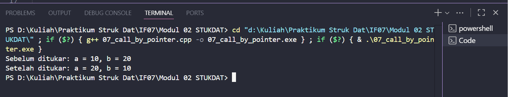
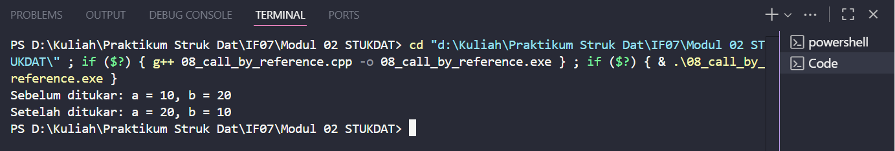
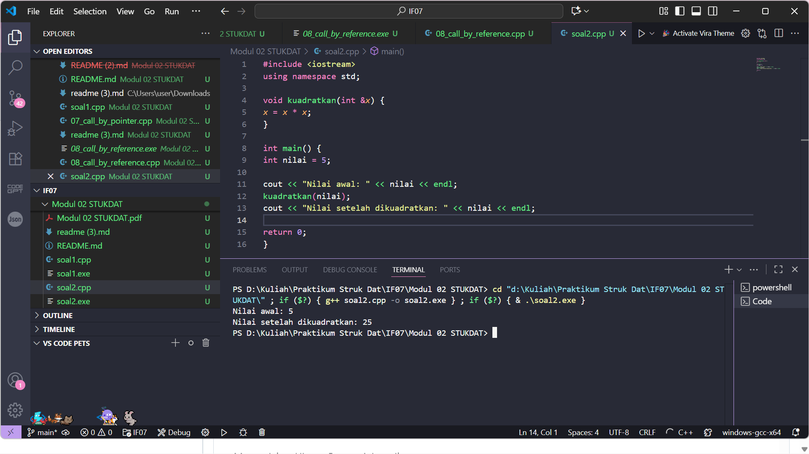
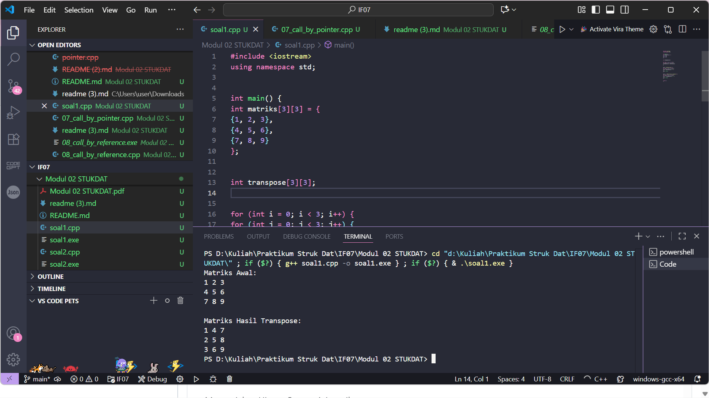

# <h1 align="center">Laporan Praktikum Modul 2 <br> Pengantar Bahasa C++ (Bagian Kedua)</h1>
<p align="center">Salsabilla Nurul Hassanah - 103112430256</p>

## Dasar Teori

Bahasa pemrograman **C++** merupakan bahasa tingkat tinggi yang mendukung paradigma **prosedural** dan **berorientasi objek**. Dalam modul ini dibahas lanjutan dari konsep dasar C++, yaitu **array**, **pointer**, **fungsi**, dan **prosedur**.

**Array** adalah kumpulan elemen data bertipe sama yang disimpan dalam lokasi memori berurutan dan diakses menggunakan indeks.  
- *Array satu dimensi* digunakan untuk menyimpan data linear seperti daftar nilai.  
- *Array dua dimensi* berbentuk tabel dan dapat menampung data baris–kolom.  

**Pointer** adalah variabel yang menyimpan alamat memori dari variabel lain. Pointer dapat digunakan untuk mengakses dan memanipulasi nilai variabel yang ditunjuknya. Misalnya, dengan `int *p; p = &a;`, maka `p` menunjuk ke variabel `a`, dan nilai `a` bisa diakses dengan `*p`.

Keterkaitan antara pointer dan array sangat erat, karena nama array sebenarnya merupakan pointer ke elemen pertamanya. Selain itu, pointer juga digunakan dalam **string**, di mana string dianggap sebagai array karakter yang diakhiri dengan karakter `\0`.

**Fungsi** adalah blok kode yang menjalankan tugas tertentu dan dapat mengembalikan nilai. Fungsi bertujuan agar program lebih modular dan efisien. Contoh bentuk fungsi:
```cpp
int tambah(int a, int b) {
    return a + b;
}
```

**Prosedur** (fungsi `void`) adalah fungsi yang tidak mengembalikan nilai, contohnya:
```cpp
void tampil() {
    cout << "Hello World";
}
```

Parameter dalam fungsi dapat dilewatkan dengan tiga cara:
1. **Call by Value** – nilai parameter dikopi, perubahan tidak memengaruhi variabel asli.  
2. **Call by Pointer** – melewatkan alamat memori, sehingga nilai asli dapat diubah.  
3. **Call by Reference** – menggunakan referensi variabel agar perubahan di fungsi memengaruhi variabel asli.

---

## Guided

### Soal 1 Call By Pointer

Mengerjakan call by pointer

```cpp
#include <iostream>
using namespace std;

void tukar(int *px, int *py)
{
    int temp = *px;
    *px = *py;
    *py = temp;
}

int main()
{
    int a = 10, b = 20;
    cout << "Sebelum ditukar: a = " << a << ", b = " << b << endl;

    tukar(&a, &b);

    cout << "Setelah ditukar: a = " << a << ", b = " << b << endl;
    return 0;
}

```

> Output  
> 

Program diminta membuat fungsi tukar() yang menukar nilai dua variabel dengan menggunakan pointer. Pada fungsi ini, parameter berupa alamat memori dari variabel a dan b, yang dikirim dengan tanda & saat pemanggilan (tukar(&a, &b)). Di dalam fungsi, operator * digunakan untuk mengakses nilai dari alamat tersebut sehingga nilai asli kedua variabel dapat diubah. Hasilnya, nilai a dan b tertukar setelah fungsi dijalankan karena pointer mengubah data langsung di alamat memorinya.

---

### Soal 2 Call by Refrence

Mengerjakan Call By Reference

```cpp
#include <iostream>
using namespace std;

void tukar(int &x, int &y)
{
    int temp = x;
    x = y;
    y = temp;
}

int main()
{
    int a = 10, b = 20;
    cout << "Sebelum ditukar: a = " << a << ", b = " << b << endl;
    tukar(a, b);
    cout << "Setelah ditukar: a = " << a << ", b = " << b << endl;
    return 0;
}

```

> Output  
> 

Program ini juga menukar dua nilai, tapi tanpa kirim alamat secara manual. Variabel dikirim sebagai referensi, jadi fungsi langsung bekerja pada data aslinya. Hasilnya, nilai kedua variabel langsung tertukar setelah fungsi selesai dijalankan.

## Unguided

### Soal 1

Buatlah sebuah program untuk melakukan transpose pada sebuah matriks persegi berukuran 3x3. Operasi transpose adalah mengubah baris menjadi kolom dan sebaliknya. Inisialisasi matriks awal di dalam kode, kemudian buat logika untuk melakukan transpose dan simpan hasilnya ke dalam matriks baru. Terakhir, tampilkan matriks awal dan matriks hasil transpose.

```cpp

#include <iostream>
using namespace std;

int main() {
int matriks[3][3] = {
{1, 2, 3},
{4, 5, 6},
{7, 8, 9}
};

int transpose[3][3];

for (int i = 0; i < 3; i++) {
for (int j = 0; j < 3; j++) {
transpose[j][i] = matriks[i][j];
}
}

cout << "Matriks Awal:\n";
for (int i = 0; i < 3; i++) {
for (int j = 0; j < 3; j++) {
cout << matriks[i][j] << " ";
}
cout << endl;
}

cout << "\nMatriks Hasil Transpose:\n";
for (int i = 0; i < 3; i++) {
for (int j = 0; j < 3; j++) {
cout << transpose[i][j] << " ";
}
cout << endl;
}

return 0;
}
```

> Output  
> 

**Penjelasan:**  
Program di atas mendefinisikan sebuah matriks 3x3 dan menyimpannya dalam array dua dimensi. Logika transpose dilakukan dengan menukar indeks baris dan kolom (transpose[j][i] = matriks[i][j]). Hasil akhirnya ditampilkan dalam bentuk matriks baru yang merupakan transpose dari matriks awal

---

### Soal 2

Buatlah program yang menunjukkan penggunaan call by reference. Buat sebuah prosedur bernama kuadratkan yang menerima satu parameter integer secara referensi (&). Prosedur ini akan mengubah nilai asli variabel yang dilewatkan dengan nilai kuadratnya. Tampilkan nilai variabel di main() sebelum dan sesudah memanggil prosedur untuk membuktikan perubahannya.

```cpp

#include <iostream>
using namespace std;

void kuadratkan(int &x) {
x = x * x;
}

int main() {
int nilai = 5;

cout << "Nilai awal: " << nilai << endl;
kuadratkan(nilai);
cout << "Nilai setelah dikuadratkan: " << nilai << endl;

return 0;
}
```

> Output  
> 

**Penjelasan:**  
Program ini menggunakan konsep call by reference, di mana parameter x di fungsi kuadratkan merujuk langsung ke variabel nilai di main(). Saat nilai x diubah di dalam fungsi, perubahan tersebut juga terjadi pada variabel aslinya di luar fungsi. Oleh karena itu, setelah pemanggilan fungsi, nilai variabel berubah dari 5 menjadi 25.


## Referensi

1. Modul Praktikum Struktur Data, Modul 02 – *Pengenalan Bahasa C++ (Bagian Kedua)*, Telkom University, 2025.  
2. https://cplusplus.com/doc/tutorial/pointers/  
3. https://en.wikipedia.org/wiki/Data_structure

