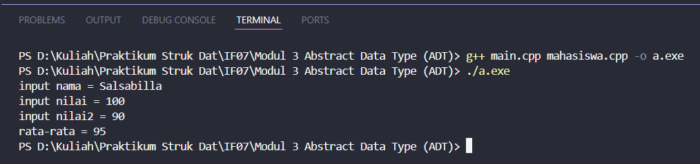
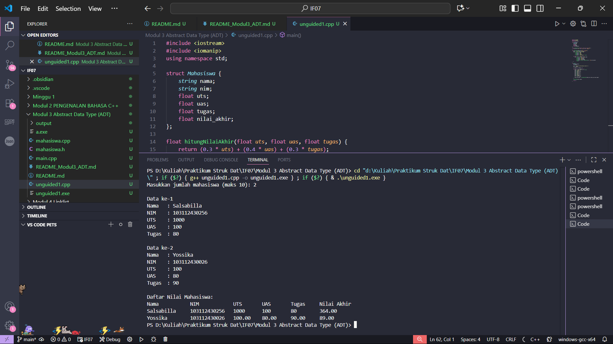
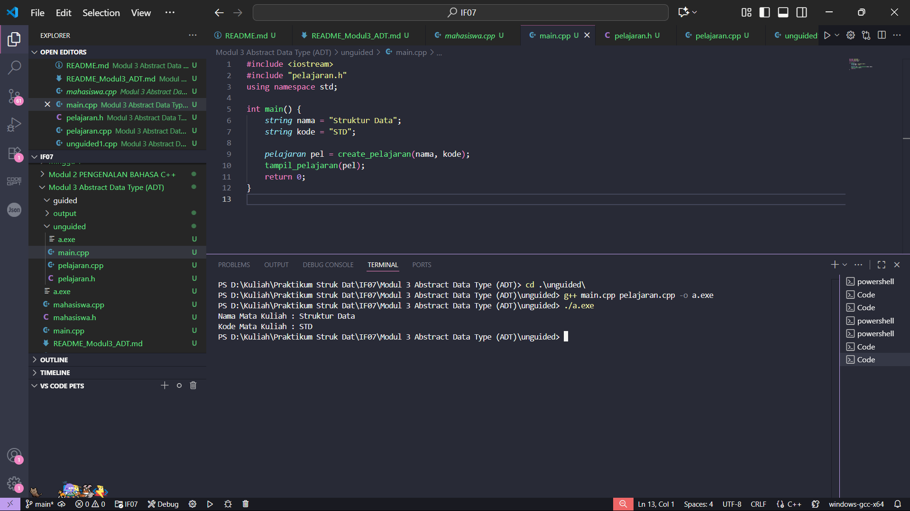
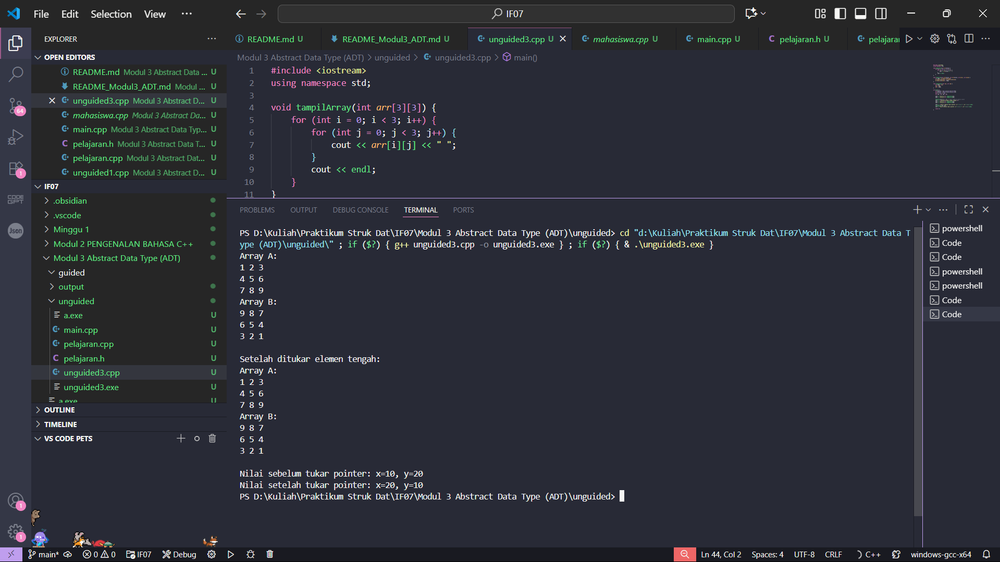

# <h1 align="center">Laporan Praktikum Modul 3 <br> ABSTRACT DATA TYPE (ADT)</h1>
<p align="center">Salsabilla Nurul Hassanah - 103112430256</p>

---

## Dasar Teori

**Abstract Data Type (ADT)** adalah tipe data yang didefinisikan secara abstrak, yaitu hanya menjelaskan *apa yang dapat dilakukan* terhadap data tanpa menjelaskan *bagaimana cara implementasinya*. ADT terdiri dari dua komponen utama, yaitu **definisi tipe data (type)** dan **sekumpulan operasi dasar (primitif)** yang dapat dilakukan terhadap tipe data tersebut.

Dalam pemrograman **C++**, ADT biasanya direpresentasikan dengan **`struct`** atau **`class`**, dan operasi primitifnya diwujudkan dalam bentuk **fungsi atau prosedur**. Tujuan penggunaan ADT adalah agar program lebih **modular, terstruktur, dan mudah dipelihara**, karena implementasi dan spesifikasi dipisahkan dalam file yang berbeda.

Beberapa kategori operasi dasar (primitif) dalam ADT meliputi:
1. **Konstruktor/Kreator** – membentuk nilai awal dari tipe data (biasanya diawali dengan `Make`).
2. **Selector** – mengakses komponen dari tipe data (biasanya diawali `Get`).
3. **Mutator/Modifier** – mengubah nilai dari komponen tipe data.
4. **Validator** – memeriksa validitas nilai yang akan membentuk tipe data.
5. **Destruktor** – menghapus atau membebaskan memori dari objek.
6. **I/O Interface** – prosedur baca/tulis data dari atau ke perangkat input/output.
7. **Operator Relasional dan Aritmetika** – mendefinisikan operasi perbandingan dan perhitungan antar objek ADT.
8. **Konversi Tipe** – mengubah tipe ADT ke tipe dasar atau sebaliknya.

Struktur umum implementasi ADT dalam C++ biasanya dipisah menjadi tiga berkas utama:
1. **File Header (.h)** → berisi definisi `struct` dan deklarasi fungsi/prosedur (spesifikasi).
2. **File Implementasi (.cpp)** → berisi isi atau realisasi fungsi/prosedur.
3. **File Main (.cpp)** → berisi program utama yang menggunakan ADT tersebut.

Sebagai contoh, ADT `mahasiswa` dapat memiliki atribut `nim`, `nilai1`, dan `nilai2`, serta fungsi `inputMhs()` untuk memasukkan data dan `rata2()` untuk menghitung nilai rata-rata.  
Pemecahan program menjadi tiga file (`mahasiswa.h`, `mahasiswa.cpp`, dan `main.cpp`) menunjukkan penerapan prinsip ADT, di mana spesifikasi dan implementasi dipisahkan untuk meningkatkan keterbacaan dan pemeliharaan kode.

Dengan demikian, konsep ADT berperan penting dalam membangun sistem data yang lebih **terenkapsulasi**, **fleksibel**, dan **mudah diperluas** tanpa perlu mengubah kode program utama.

---

## Guided

### Soal 1 – ADT Mahasiswa

Buatlah program sederhana dengan ADT **mahasiswa** yang memiliki atribut `nim`, `nilai1`, dan `nilai2`. Buat dua fungsi:  
- `inputMhs()` → untuk menginput data mahasiswa  
- `rata2()` → untuk menghitung rata-rata nilai  

Struktur program dibagi menjadi tiga file:  
`mahasiswa.h`, `mahasiswa.cpp`, dan `main.cpp`.

#### mahasiswa.h
```cpp
#ifndef MAHASISWA_H_INCLUDED
#define MAHASISWA_H_INCLUDED

struct mahasiswa {
    char nim[10];
    int nilai1, nilai2;
};

void inputMhs(mahasiswa &m);
float rata2(mahasiswa m);

#endif
```

#### mahasiswa.cpp
```cpp
#include <iostream>
#include "mahasiswa.h"
using namespace std;

void inputMhs(mahasiswa &m) {
    cout << "Input NIM: ";
    cin >> m.nim;
    cout << "Input Nilai 1: ";
    cin >> m.nilai1;
    cout << "Input Nilai 2: ";
    cin >> m.nilai2;
}

float rata2(mahasiswa m) {
    return float(m.nilai1 + m.nilai2) / 2;
}
```

#### main.cpp
```cpp
#include <iostream>
#include "mahasiswa.h"
using namespace std;

int main() {
    mahasiswa mhs;
    inputMhs(mhs);
    cout << "Rata-rata nilai: " << rata2(mhs);
    return 0;
}
```

> **Output:**  
> 

**Penjelasan:**  
Program ini menunjukkan penerapan ADT dengan memisahkan spesifikasi (`mahasiswa.h`), implementasi (`mahasiswa.cpp`), dan pemanggilan utama (`main.cpp`). Fungsi `inputMhs` digunakan untuk mengisi nilai atribut dari struct `mahasiswa`, sedangkan `rata2` digunakan untuk menghitung nilai rata-rata dua nilai ujian mahasiswa.

---

## Unguided

### Soal 1 – Array

Buat program yang dapat menyimpan data mahasiswa (max. 10) ke dalam sebuah array dengan field nama, nim, uts, uas, tugas, dan nilai akhir. Nilai akhir diperoleh dari FUNGSI dengan rumus:

0.3 * uts + 0.4 * uas + 0.3 * tugas  

#### unguided1.cpp
```cpp
#include <iostream>
#include <iomanip>
using namespace std;

struct Mahasiswa {
    string nama;
    string nim;
    float uts;
    float uas;
    float tugas;
    float nilai_akhir;
};

// Fungsi untuk menghitung nilai akhir
float hitungNilaiAkhir(float uts, float uas, float tugas) {
    return (0.3 * uts) + (0.4 * uas) + (0.3 * tugas);
}

// Prosedur untuk menampilkan data mahasiswa
void tampilkanData(Mahasiswa mhs[], int jumlah) {
    cout << "\nDaftar Nilai Mahasiswa:\n";
    cout << left << setw(15) << "Nama"
         << setw(15) << "NIM"
         << setw(10) << "UTS"
         << setw(10) << "UAS"
         << setw(10) << "Tugas"
         << setw(15) << "Nilai Akhir" << endl;

    for (int i = 0; i < jumlah; i++) {
        cout << left << setw(15) << mhs[i].nama
             << setw(15) << mhs[i].nim
             << setw(10) << mhs[i].uts
             << setw(10) << mhs[i].uas
             << setw(10) << mhs[i].tugas
             << setw(15) << fixed << setprecision(2) << mhs[i].nilai_akhir
             << endl;
    }
}

int main() {
    Mahasiswa mhs[10];
    int jumlah;

    cout << "Masukkan jumlah mahasiswa (maks 10): ";
    cin >> jumlah;

    if (jumlah > 10) jumlah = 10;

    // Input data mahasiswa
    for (int i = 0; i < jumlah; i++) {
        cout << "\nData ke-" << i + 1 << endl;
        cout << "Nama   : ";
        cin >> mhs[i].nama;
        cout << "NIM    : ";
        cin >> mhs[i].nim;
        cout << "UTS    : ";
        cin >> mhs[i].uts;
        cout << "UAS    : ";
        cin >> mhs[i].uas;
        cout << "Tugas  : ";
        cin >> mhs[i].tugas;

        // Hitung nilai akhir
        mhs[i].nilai_akhir = hitungNilaiAkhir(mhs[i].uts, mhs[i].uas, mhs[i].tugas);
    }

    // Tampilkan hasil data mahasiswa
    tampilkanData(mhs, jumlah);

    return 0;
}
```

> **Output:**  
> 

**Penjelasan:**  
Program ini mencontohkan pembuatan dan penggunaan ADT `pelajaran`. Fungsi `create_pelajaran` berfungsi sebagai konstruktor untuk membentuk data pelajaran, sedangkan `tampil_pelajaran` digunakan sebagai interface untuk menampilkan data ke layar.

---

### Soal 2 – Pelajaran ADT

Buatlah ADT `pelajaran` dengan atribut `namaMapel` dan `kodeMapel`.  
Implementasikan dua fungsi:  
- `create_pelajaran()` → membuat dan mengembalikan data pelajaran  
- `tampil_pelajaran()` → menampilkan data pelajaran  

#### pelajaran.h
```cpp
#ifndef PELAJARAN_H_INCLUDED
#define PELAJARAN_H_INCLUDED
#include <string>
using namespace std;

struct pelajaran {
    string namaMapel;
    string kodeMapel;
};

pelajaran create_pelajaran(string namaPel, string kodePel);
void tampil_pelajaran(pelajaran pel);

#endif

```
#### pelajaran.cpp
```cpp
#include <iostream>
#include "pelajaran.h"
using namespace std;

pelajaran create_pelajaran(string namaPel, string kodePel) {
    pelajaran p;
    p.namaMapel = namaPel;
    p.kodeMapel = kodePel;
    return p;
}

void tampil_pelajaran(pelajaran pel) {
    cout << "Nama Mata Kuliah : " << pel.namaMapel << endl;
    cout << "Kode Mata Kuliah : " << pel.kodeMapel << endl;
}
```

#### main.cpp
```cpp
#include <iostream>
#include "pelajaran.h"
using namespace std;

int main() {
    string nama = "Struktur Data";
    string kode = "STD";

    pelajaran pel = create_pelajaran(nama, kode);
    tampil_pelajaran(pel);
    return 0;
}
```

> **Output:**  
> 

**Penjelasan:**  
Program ini mencontohkan pembuatan dan penggunaan ADT `pelajaran`. Fungsi `create_pelajaran` berfungsi sebagai konstruktor untuk membentuk data pelajaran, sedangkan `tampil_pelajaran` digunakan sebagai interface untuk menampilkan data ke layar.


### Soal 3 – Operasi Array 2D & Pointer

Buatlah program yang terdiri dari:  
- Dua array 2D berukuran 3x3  
- Dua pointer integer  
- Fungsi untuk menampilkan array  
- Fungsi untuk menukar isi array dan nilai pointer tertentu  

#### Program:
```cpp
#include <iostream>
using namespace std;

void tampilArray(int arr[3][3]) {
    for (int i = 0; i < 3; i++) {
        for (int j = 0; j < 3; j++) {
            cout << arr[i][j] << " ";
        }
        cout << endl;
    }
}

void tukarArray(int arr1[3][3], int arr2[3][3], int baris, int kolom) {
    int temp = arr1[baris][kolom];
    arr1[baris][kolom] = arr2[baris][kolom];
    arr2[baris][kolom] = temp;
}

void tukarPointer(int *p1, int *p2) {
    int temp = *p1;
    *p1 = *p2;
    *p2 = temp;
}

int main() {
    int A[3][3] = {{1,2,3},{4,5,6},{7,8,9}};
    int B[3][3] = {{9,8,7},{6,5,4},{3,2,1}};
    int x = 10, y = 20;
    int *p1 = &x, *p2 = &y;

    cout << "Array A:\n"; tampilArray(A);
    cout << "Array B:\n"; tampilArray(B);

    tukarArray(A, B, 1, 1); // tukar elemen di posisi [1][1]
    cout << "\nSetelah ditukar elemen tengah:\n";
    cout << "Array A:\n"; tampilArray(A);
    cout << "Array B:\n"; tampilArray(B);

    cout << "\nNilai sebelum tukar pointer: x=" << x << ", y=" << y << endl;
    tukarPointer(p1, p2);
    cout << "Nilai setelah tukar pointer: x=" << x << ", y=" << y << endl;

    return 0;
}
```

> **Output:**  
> 

**Penjelasan:**  
Program ini menggabungkan konsep **array 2D** dan **pointer** dalam konteks ADT.  
- `tukarArray()` bertugas menukar elemen antar dua array 2D.  
- `tukarPointer()` menukar isi dua variabel melalui alamat memori.  
Keduanya menunjukkan manipulasi data dengan cara modular dan terstruktur sesuai prinsip ADT.

---

## Referensi

1. Modul Praktikum Struktur Data, **Modul 03 – Abstract Data Type (ADT)**, Telkom University, 2025.  
2. https://cplusplus.com/doc/tutorial/structures/  
3. https://en.wikipedia.org/wiki/Abstract_data_type
