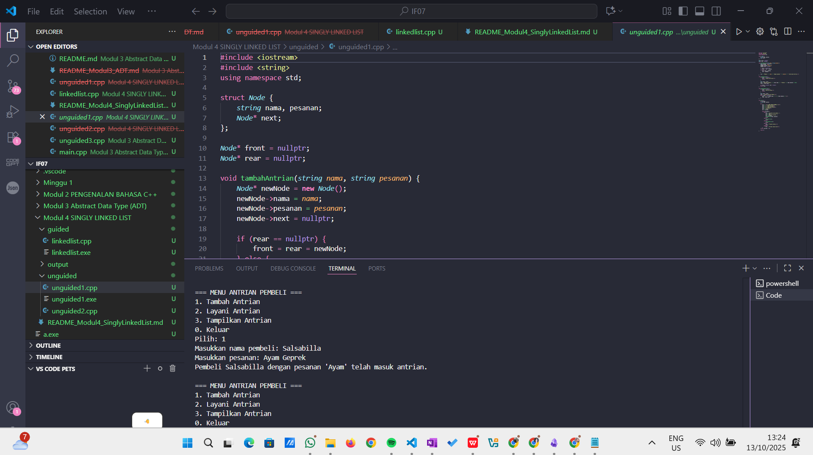

# <h1 align="center">Laporan Praktikum Modul 4 <br> SINGLY LINKED LIST</h1>
<p align="center">Salsabilla Nurul Hassanah - 103112430256</p>

---

## Dasar Teori

**Linked List** adalah struktur data dinamis yang terdiri dari kumpulan node yang saling terhubung menggunakan pointer. Setiap node menyimpan dua bagian data:
1. **Data** — informasi utama yang disimpan (misalnya angka, nama, atau objek lain).  
2. **Pointer (next)** — penunjuk ke node berikutnya dalam daftar.

Pada **Singly Linked List**, setiap node hanya memiliki satu arah pointer, yaitu menuju node berikutnya. Node terakhir memiliki nilai pointer `NULL`, menandakan akhir dari list.

### Karakteristik Singly Linked List
1. Hanya memerlukan satu pointer per node (`next`).
2. Akses dilakukan secara sekuensial dari awal (tidak bisa mundur).
3. Bersifat **dinamis**, dapat bertambah dan berkurang selama program berjalan.
4. Cocok digunakan untuk operasi *insert* dan *delete* di tengah list.

### Komponen Utama
- **head / first** : pointer yang menunjuk node pertama.
- **node / elemen / simpul** : unit dasar yang menyimpan data dan pointer.
- **NULL** : menandakan akhir dari list.

### Operasi Dasar
1. **Create List** → Membuat list kosong.  
2. **Insert** → Menambahkan node baru (awal, tengah, atau akhir).  
3. **Delete** → Menghapus node tertentu.  
4. **View / Traverse** → Menampilkan seluruh isi list.  
5. **Update** → Mengubah isi data node tertentu.  
6. **Search** → Mencari node berdasarkan nilai tertentu.

Dengan Linked List, memori dapat dialokasikan secara dinamis, sehingga lebih fleksibel dibandingkan array statis.

---

## Guided

### Soal Guided – Implementasi Dasar Singly Linked List

Program berikut mengimplementasikan operasi dasar pada **Single Linked List**, yaitu *insert*, *delete*, *update*, dan *view* menggunakan pointer.

#### linkedlist.cpp
```cpp
#include <iostream>
using namespace std;

// Struktur Node
struct Node {
    int data;
    Node* next;
};

Node* head = nullptr;

Node* createNode(int data) {
    Node* newNode = new Node();
    newNode->data = data;
    newNode->next = nullptr;
    return newNode;
}

void insertBelakang(int data) {
    Node* newNode = createNode(data);
    if (head == nullptr) {
        head = newNode;
    } else {
        Node* temp = head;
        while (temp->next != nullptr) {
            temp = temp->next;
        }
        temp->next = newNode;
    }
    cout << "Data " << data << " berhasil ditambahkan di belakang.\n";
}

void insertSetelah(int target, int dataBaru) {
    Node* temp = head;
    while (temp != nullptr && temp->data != target) {
        temp = temp->next;
    }

    if (temp == nullptr) {
        cout << "Data " << target << " tidak ditemukan!\n";
    } else {
        Node* newNode = createNode(dataBaru);
        newNode->next = temp->next;
        temp->next = newNode;
        cout << "Data " << dataBaru << " berhasil disisipkan setelah " << target << ".\n";
    }
}

void hapusNode(int data) {
    if (head == nullptr) {
        cout << "List kosong!\n";
        return;
    }

    Node* temp = head;
    Node* prev = nullptr;

    if (temp != nullptr && temp->data == data) {
        head = temp->next;
        delete temp;
        cout << "Data " << data << " berhasil dihapus.\n";
        return;
    }

    while (temp != nullptr && temp->data != data) {
        prev = temp;
        temp = temp->next;
    }

    if (temp == nullptr) {
        cout << "Data " << data << " tidak ditemukan!\n";
        return;
    }

    prev->next = temp->next;
    delete temp;
    cout << "Data " << data << " berhasil dihapus.\n";
}

void updateNode(int dataLama, int dataBaru) {
    Node* temp = head;
    while (temp != nullptr && temp->data != dataLama) {
        temp = temp->next;
    }

    if (temp == nullptr) {
        cout << "Data " << dataLama << " tidak ditemukan!\n";
    } else {
        temp->data = dataBaru;
        cout << "Data " << dataLama << " berhasil diupdate menjadi " << dataBaru << ".\n";
    }
}

void tampilkanList() {
    if (head == nullptr) {
        cout << "List kosong!\n";
        return;
    }

    Node* temp = head;
    cout << "Isi Linked List: ";
    while (temp != nullptr) {
        cout << temp->data << " -> ";
        temp = temp->next;
    }
    cout << "NULL\n";
}

int main() {
    int pilihan, data, target, dataBaru;

    do {
        cout << "\n=== MENU SINGLE LINKED LIST ===\n";
        cout << "1. Insert Belakang\n";
        cout << "2. Insert Setelah\n";
        cout << "3. Hapus Data\n";
        cout << "4. Update Data\n";
        cout << "5. Tampilkan List\n";
        cout << "0. Keluar\n";
        cout << "Pilih: ";
        cin >> pilihan;

        switch (pilihan) {
            case 1:
                cout << "Masukkan data: ";
                cin >> data;
                insertBelakang(data);
                break;
            case 2:
                cout << "Masukkan data target: ";
                cin >> target;
                cout << "Masukkan data baru: ";
                cin >> dataBaru;
                insertSetelah(target, dataBaru);
                break;
            case 3:
                cout << "Masukkan data yang ingin dihapus: ";
                cin >> data;
                hapusNode(data);
                break;
            case 4:
                cout << "Masukkan data lama: ";
                cin >> data;
                cout << "Masukkan data baru: ";
                cin >> dataBaru;
                updateNode(data, dataBaru);
                break;
            case 5:
                tampilkanList();
                break;
            case 0:
                cout << "Program selesai.\n";
                break;
            default:
                cout << "Pilihan tidak valid!\n";
        }
    } while (pilihan != 0);

    return 0;
}
```

> **Output:**  
> 

**Penjelasan:**  
Program ini mengimplementasikan operasi dasar *singly linked list* dengan menu interaktif. Pengguna dapat menambahkan data, menyisipkan node setelah data tertentu, menghapus node, memperbarui nilai, dan menampilkan seluruh isi list.

---

## Unguided

### Soal 1 – Antrian Pembeli Menggunakan Single Linked List

buatlah single linked list untuk Antrian yang menyimpan data pembeli( nama dan pesanan). program memiliki beberapa menu seperti tambah antrian,  layani antrian(hapus), dan tampilkan antrian. \*antrian pertama harus yang pertama dilayani

#### Program:
```cpp
#include <iostream>
#include <string>
using namespace std;

struct Node {
    string nama, pesanan;
    Node* next;
};

Node* front = nullptr;
Node* rear = nullptr;

void tambahAntrian(string nama, string pesanan) {
    Node* newNode = new Node();
    newNode->nama = nama;
    newNode->pesanan = pesanan;
    newNode->next = nullptr;

    if (rear == nullptr) {
        front = rear = newNode;
    } else {
        rear->next = newNode;
        rear = newNode;
    }

    cout << "Pembeli " << nama << " dengan pesanan '" << pesanan << "' telah masuk antrian.\n";
}

void layaniAntrian() {
    if (front == nullptr) {
        cout << "Tidak ada antrian!\n";
        return;
    }

    Node* temp = front;
    cout << "Melayani pembeli: " << temp->nama << " - Pesanan: " << temp->pesanan << endl;
    front = front->next;

    if (front == nullptr) rear = nullptr;
    delete temp;
}

void tampilkanAntrian() {
    if (front == nullptr) {
        cout << "Antrian kosong.\n";
        return;
    }

    Node* temp = front;
    cout << "\nDaftar Antrian Pembeli:\n";
    while (temp != nullptr) {
        cout << "- " << temp->nama << " (" << temp->pesanan << ")\n";
        temp = temp->next;
    }
}

int main() {
    int pilihan;
    string nama, pesanan;

    do {
        cout << "\n=== MENU ANTRIAN PEMBELI ===\n";
        cout << "1. Tambah Antrian\n";
        cout << "2. Layani Antrian\n";
        cout << "3. Tampilkan Antrian\n";
        cout << "0. Keluar\n";
        cout << "Pilih: ";
        cin >> pilihan;

        switch (pilihan) {
            case 1:
                cout << "Masukkan nama pembeli: ";
                cin >> nama;
                cout << "Masukkan pesanan: ";
                cin >> pesanan;
                tambahAntrian(nama, pesanan);
                break;
            case 2:
                layaniAntrian();
                break;
            case 3:
                tampilkanAntrian();
                break;
            case 0:
                cout << "Program selesai.\n";
                break;
            default:
                cout << "Pilihan tidak valid!\n";
        }
    } while (pilihan != 0);

    return 0;
}
```

> **Output:**  
> 

**Penjelasan:**  
Program ini menggunakan *Single Linked List* sebagai struktur antrian,   
Data yang pertama masuk akan menjadi yang pertama dilayani (FIFO). Operasi yang digunakan adalah:
- `tambahAntrian()`   
- `layaniAntrian()`   
- `tampilkanAntrian()` 

---

### Soal 2 – Membalik (Reverse) Single Linked List

buatlah program kode untuk membalik (reverse) singly linked list (1-2-3 menjadi 3-2-1) 
#### Program:
```cpp
#include <iostream>
using namespace std;

struct Node {
    int data;
    Node* next;
};

Node* head = nullptr;

void tambahNode(int data) {
    Node* newNode = new Node();
    newNode->data = data;
    newNode->next = head;
    head = newNode;
}

void tampilkanList(Node* node) {
    while (node != nullptr) {
        cout << node->data << " -> ";
        node = node->next;
    }
    cout << "NULL\n";
}

Node* reverseList(Node* node) {
    Node* prev = nullptr;
    Node* current = node;
    Node* next = nullptr;

    while (current != nullptr) {
        next = current->next;
        current->next = prev;
        prev = current;
        current = next;
    }
    return prev;
}

int main() {
    tambahNode(3);
    tambahNode(2);
    tambahNode(1);

    cout << "List Awal: ";
    tampilkanList(head);

    head = reverseList(head);

    cout << "List Setelah Dibalik: ";
    tampilkanList(head);

    return 0;
}
```

> **Output:**  
> 

**Penjelasan:**  
Program ini membalik urutan node pada singly linked list menggunakan tiga pointer:  
`prev`, `current`, dan `next`. Proses dilakukan dengan memutar arah pointer `next` secara iteratif sehingga list menjadi terbalik dari urutan awalnya.

---

## Referensi

1. Modul Praktikum Struktur Data, **Modul 04 – Singly Linked List**, Telkom University, 2025.  
2. Malik, D. S. (2018). *C++ Programming: From Problem Analysis to Program Design*. Cengage Learning.  
3. Goodrich, M. T., Tamassia, R., & Goldwasser, M. H. (2014). *Data Structures and Algorithms in C++*. Wiley.  
4. GeeksforGeeks. (2023). [Singly Linked List in C++](https://www.geeksforgeeks.org/data-structures/linked-list/singly-linked-list/)  
5. TutorialsPoint. (2024). [C++ Linked List Tutorial](https://www.tutorialspoint.com/cplusplus/cpp_linked_lists.htm)
