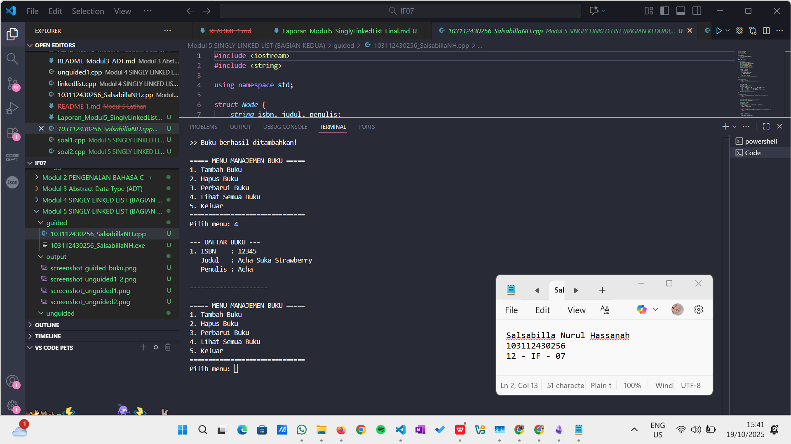

# <h1 align="center">Laporan Praktikum Modul 5 <br> SINGLY LINKED LIST (Bagian Kedua)</h1>
<p align="center">Salsabilla Nurul Hassanah - 103112430256</p>

---

## Dasar Teori

### Singly Linked List (Bagian Kedua)

Pada **Modul 5**, fokus utama adalah memahami **penggunaan pointer operator** serta **operasi dasar** seperti pencarian (*searching*), penambahan, dan penghapusan elemen dalam **Singly Linked List**.

####  Pengertian
**Singly Linked List** adalah kumpulan node di mana setiap node berisi:
- **info (data)** — nilai atau informasi yang disimpan,
- **next (pointer)** — penunjuk ke node berikutnya.

Node terakhir memiliki `next = NULL` yang menandakan akhir list.

####  Operasi Dasar
1. **Create List** → Membuat list kosong.
2. **Insert** → Menambah node di awal, tengah, atau akhir.
3. **Delete** → Menghapus node tertentu.
4. **Print Info** → Menampilkan seluruh data node.
5. **Searching** → Mencari node berdasarkan nilai tertentu.
6. **Invert** → Membalik urutan node.

#### Searching
Merupakan proses mengunjungi setiap node untuk menemukan data tertentu. Proses berhenti jika data ditemukan atau list sudah habis. Searching menjadi dasar bagi operasi lain seperti:
- `insertAfter()`
- `deleteAfter()`
- `update()`

---


## Guided

### Soal Guided – Implementasi Dasar *Singly Linked List* (Manajemen Buku)

Program berikut mengimplementasikan **operasi dasar pada Singly Linked List**, yaitu:

- Tambah buku (*insert last*)  
- Hapus buku (*delete by ISBN*)  
- Perbarui data buku (*update*)  
- Lihat semua buku (*traversal*)

#### Program:
```cpp
#include <iostream>
#include <string>

using namespace std;

struct Node {
    string isbn, judul, penulis;
    Node* next;
};

Node* head = NULL;

void tambahBuku() {
    Node* newNode = new Node();
    cout << "Masukkan ISBN: ";
    getline(cin >> ws, newNode->isbn);
    cout << "Masukkan Judul: ";
    getline(cin, newNode->judul);
    cout << "Masukkan Penulis: ";
    getline(cin, newNode->penulis);
    newNode->next = NULL;

    if (head == NULL) {
        head = newNode;
    } else {
        Node* temp = head;
        while (temp->next != NULL) {
            temp = temp->next;
        }
        temp->next = newNode;
    }
    cout << "
>> Buku berhasil ditambahkan!
";
}

void lihatBuku() {
    if (head == NULL) {
        cout << "
>> List buku masih kosong.
";
        return;
    }

    Node* temp = head;
    int nomor = 1;
    cout << "
--- DAFTAR BUKU ---
";
    while (temp != NULL) {
        cout << nomor++ << ". ISBN    : " << temp->isbn << endl;
        cout << "   Judul   : " << temp->judul << endl;
        cout << "   Penulis : " << temp->penulis << endl << endl;
        temp = temp->next;
    }
    cout << "---------------------
";
}

void hapusBuku() {
    if (head == NULL) {
        cout << "
>> List buku kosong, tidak ada yang bisa dihapus.
";
        return;
    }

    string isbnTarget;
    cout << "Masukkan ISBN buku yang akan dihapus: ";
    getline(cin >> ws, isbnTarget);

    Node* current = head;
    Node* prev = NULL;

    while (current != NULL && current->isbn != isbnTarget) {
        prev = current;
        current = current->next;
    }

    if (current == NULL) {
        cout << "
>> Buku dengan ISBN " << isbnTarget << " tidak ditemukan.
";
        return;
    }

    if (prev == NULL) {
        head = current->next;
    } else {
        prev->next = current->next;
    }

    delete current;
    cout << "
>> Buku berhasil dihapus.
";
}

void perbaruiBuku() {
    if (head == NULL) {
        cout << "
>> List buku kosong.
";
        return;
    }

    string isbnTarget;
    cout << "Masukkan ISBN buku yang akan diperbarui: ";
    getline(cin >> ws, isbnTarget);

    Node* current = head;
    while (current != NULL) {
        if (current->isbn == isbnTarget) {
            cout << "Masukkan Judul baru: ";
            getline(cin, current->judul);
            cout << "Masukkan Penulis baru: ";
            getline(cin, current->penulis);
            cout << "
>> Data buku berhasil diperbarui!
";
            return;
        }
        current = current->next;
    }

    cout << "
>> Buku dengan ISBN " << isbnTarget << " tidak ditemukan.
";
}

int main() {
    int pilihan;
    do {
        cout << "
===== MENU MANAJEMEN BUKU =====
"
             << "1. Tambah Buku
"
             << "2. Hapus Buku
"
             << "3. Perbarui Buku
"
             << "4. Lihat Semua Buku
"
             << "5. Keluar
"
             << "===============================
"
             << "Pilih menu: ";
        cin >> pilihan;

        switch (pilihan) {
            case 1: tambahBuku(); break;
            case 2: hapusBuku(); break;
            case 3: perbaruiBuku(); break;
            case 4: lihatBuku(); break;
            case 5: cout << "Terima kasih!
"; break;
            default: cout << "Pilihan tidak valid!
"; break;
        }
    } while (pilihan != 5);

    return 0;
}
```

> **Output:**  
> 

---

###  Penjelasan Program:

1. **Struktur Data**  
   Program menggunakan `struct Node` yang menyimpan tiga informasi utama buku:  
   - `isbn` → Nomor unik buku  
   - `judul` → Nama buku  
   - `penulis` → Nama penulis buku  
   serta pointer `next` untuk menghubungkan node berikutnya.

2. **Tambah Buku (`tambahBuku`)**  
   Melakukan *insert last* — data baru disimpan di akhir list dengan traversal hingga node terakhir (`temp->next == NULL`).

3. **Lihat Buku (`lihatBuku`)**  
   Traversal dari `head` dan menampilkan semua data buku secara berurutan.

4. **Hapus Buku (`hapusBuku`)**  
   Menghapus node berdasarkan ISBN yang dicari. Jika node ditemukan:
   - Jika node di awal, `head` digeser.
   - Jika di tengah/akhir, pointer `prev->next` diarahkan ke node setelahnya.

5. **Perbarui Buku (`perbaruiBuku`)**  
   Mencari ISBN yang cocok, lalu memperbarui data judul dan penulis secara langsung.

6. **Loop Menu (`main`)**  
   Menggunakan menu interaktif untuk menjalankan setiap operasi di atas hingga pengguna memilih keluar.

---


## Unguided

###  Soal 1 — Tambahkan Searching Nama Pembeli
Program antrian pembeli dengan **fitur pencarian nama pembeli**.
buatlah searcing untuk mencari nama pembeli pada unguided sebelumnya

```cpp
#include <iostream>
#include <string>
using namespace std;

struct Node {
    string nama, pesanan;
    Node* next;
};

Node* front = nullptr;
Node* rear = nullptr;

void tambahAntrian(string nama, string pesanan) {
    Node* newNode = new Node();
    newNode->nama = nama;
    newNode->pesanan = pesanan;
    newNode->next = nullptr;

    if (rear == nullptr) {
        front = rear = newNode;
    } else {
        rear->next = newNode;
        rear = newNode;
    }

    cout << "Pembeli " << nama << " dengan pesanan '" << pesanan << "' masuk antrian.\n";
}

void layaniAntrian() {
    if (front == nullptr) {
        cout << "Tidak ada antrian!\n";
        return;
    }

    Node* temp = front;
    cout << "Melayani: " << temp->nama << " - Pesanan: " << temp->pesanan << endl;
    front = front->next;

    if (front == nullptr) rear = nullptr;
    delete temp;
}

void tampilkanAntrian() {
    if (front == nullptr) {
        cout << "Antrian kosong.\n";
        return;
    }

    Node* temp = front;
    cout << "\nDaftar Antrian Pembeli:\n";
    while (temp != nullptr) {
        cout << "- " << temp->nama << " (" << temp->pesanan << ")\n";
        temp = temp->next;
    }
}

void cariPembeli(string namaCari) {
    Node* temp = front;
    bool ditemukan = false;

    while (temp != nullptr) {
        if (temp->nama == namaCari) {
            cout << "Pembeli ditemukan: " << temp->nama 
                 << " - Pesanan: " << temp->pesanan << endl;
            ditemukan = true;
            break;
        }
        temp = temp->next;
    }

    if (!ditemukan)
        cout << "Pembeli dengan nama '" << namaCari << "' tidak ditemukan.\n";
}

int main() {
    int pilihan;
    string nama, pesanan, cari;

    do {
        cout << "\n=== MENU ANTRIAN PEMBELI ===\n";
        cout << "1. Tambah Antrian\n";
        cout << "2. Layani Antrian\n";
        cout << "3. Tampilkan Antrian\n";
        cout << "4. Cari Pembeli\n";
        cout << "0. Keluar\n";
        cout << "Pilih: ";
        cin >> pilihan;

        switch (pilihan) {
            case 1:
                cout << "Masukkan nama pembeli: ";
                cin >> nama;
                cout << "Masukkan pesanan: ";
                cin >> pesanan;
                tambahAntrian(nama, pesanan);
                break;
            case 2:
                layaniAntrian();
                break;
            case 3:
                tampilkanAntrian();
                break;
            case 4:
                cout << "Masukkan nama pembeli yang dicari: ";
                cin >> cari;
                cariPembeli(cari);
                break;
            case 0:
                cout << "Program selesai.\n";
                break;
            default:
                cout << "Pilihan tidak valid!\n";
        }
    } while (pilihan != 0);

    return 0;
}
```

**Penjelasan:**  
Program ini menambahkan fitur `cariPembeli()` untuk melakukan pencarian berdasarkan nama di *linked list* antrian. Pencarian dilakukan secara sekuensial dari node pertama (FIFO).

> **Output:**  
> 
> 

---

###  Soal 2 — Searching Buku Berdasarkan Judul, Penulis, dan ISBN
gunakan latihan pada pertemuan minggun ini dan tambahkan seardhing untuk mencari buku berdasarkan judul, penulis, dan ISBN

```cpp
#include <iostream>
#include <string>
using namespace std;

struct Buku {
    string judul, penulis, isbn;
    Buku* next;
};

Buku* head = nullptr;

void tambahBuku(string judul, string penulis, string isbn) {
    Buku* newBuku = new Buku();
    newBuku->judul = judul;
    newBuku->penulis = penulis;
    newBuku->isbn = isbn;
    newBuku->next = nullptr;

    if (head == nullptr)
        head = newBuku;
    else {
        Buku* temp = head;
        while (temp->next != nullptr)
            temp = temp->next;
        temp->next = newBuku;
    }

    cout << "Buku '" << judul << "' berhasil ditambahkan.\n";
}

void tampilkanBuku() {
    if (head == nullptr) {
        cout << "Tidak ada data buku.\n";
        return;
    }

    Buku* temp = head;
    cout << "\nDaftar Buku:\n";
    while (temp != nullptr) {
        cout << "- " << temp->judul << " | " << temp->penulis 
             << " | ISBN: " << temp->isbn << endl;
        temp = temp->next;
    }
}

void cariBuku(string keyword) {
    Buku* temp = head;
    bool ditemukan = false;

    while (temp != nullptr) {
        if (temp->judul == keyword || temp->penulis == keyword || temp->isbn == keyword) {
            cout << "Buku ditemukan: " << temp->judul << " | " 
                 << temp->penulis << " | ISBN: " << temp->isbn << endl;
            ditemukan = true;
        }
        temp = temp->next;
    }

    if (!ditemukan)
        cout << "Data buku dengan keyword '" << keyword << "' tidak ditemukan.\n";
}

int main() {
    int pilihan;
    string judul, penulis, isbn, keyword;

    do {
        cout << "\n=== MENU DATA BUKU ===\n";
        cout << "1. Tambah Buku\n";
        cout << "2. Tampilkan Buku\n";
        cout << "3. Cari Buku\n";
        cout << "0. Keluar\n";
        cout << "Pilih: ";
        cin >> pilihan;

        switch (pilihan) {
            case 1:
                cout << "Judul: ";
                getline(cin >> ws, judul);   
                cout << "Penulis: ";
                getline(cin, penulis);
                cout << "ISBN: ";
                getline(cin, isbn);
                tambahBuku(judul, penulis, isbn);
                break;
            case 2:
                tampilkanBuku();
                break;
            case 3:
                cout << "Masukkan keyword (judul/penulis/ISBN): ";
                getline(cin >> ws, keyword);
                cariBuku(keyword);
                break;
            case 0:
                cout << "Program selesai.\n";
                break;
            default:
                cout << "Pilihan tidak valid!\n";
        }
    } while (pilihan != 0);

    return 0;
}

```

**Penjelasan:**  
Fungsi `cariBuku()` mencari *node* berdasarkan kecocokan string pada tiga atribut: **judul**, **penulis**, atau **ISBN**.  
Metode pencarian dilakukan **sekuensial (linear search)** sesuai dengan prinsip *linked list searching* pada Modul 5.

> **Output:**  
> 
---

## Referensi

1. Modul Praktikum Struktur Data, **Modul 05 – Singly Linked List (Bagian Kedua)**, Telkom University, 2025.  
2. Malik, D. S. (2018). *C++ Programming: From Problem Analysis to Program Design*. Cengage Learning.  
3. Goodrich, M. T., Tamassia, R., & Goldwasser, M. H. (2014). *Data Structures and Algorithms in C++*. Wiley.  
4. GeeksforGeeks. (2024). [Searching in Linked List in C++](https://www.geeksforgeeks.org/search-an-element-in-a-linked-list-cpp/)  
5. TutorialsPoint. (2024). [C++ Linked List Search](https://www.tutorialspoint.com/cplusplus/cpp_linked_lists.htm)
