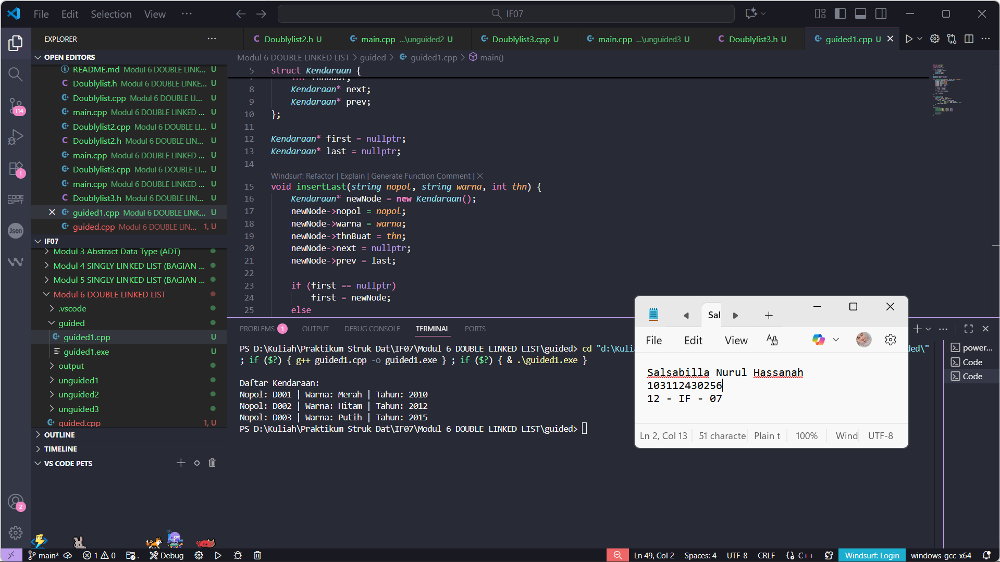
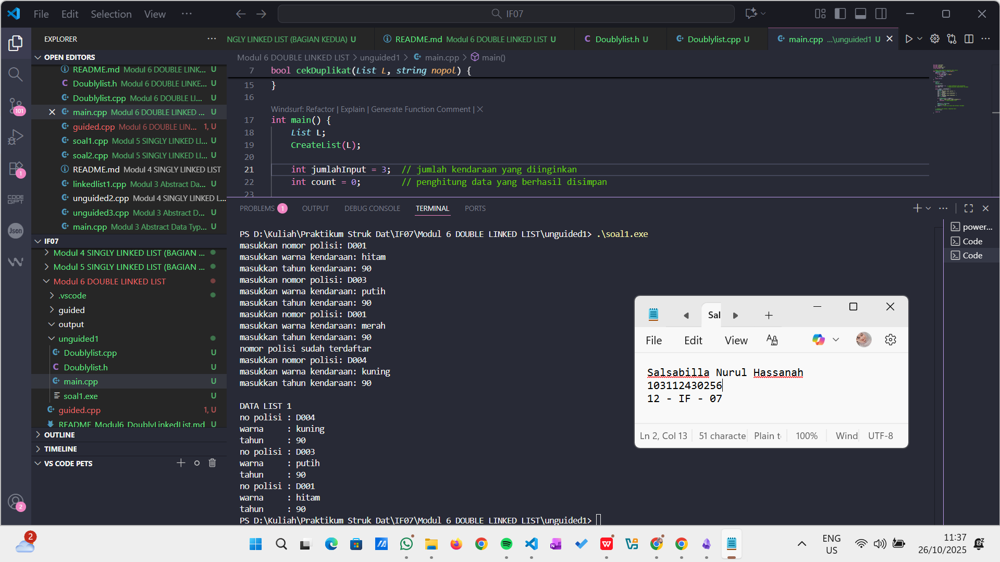
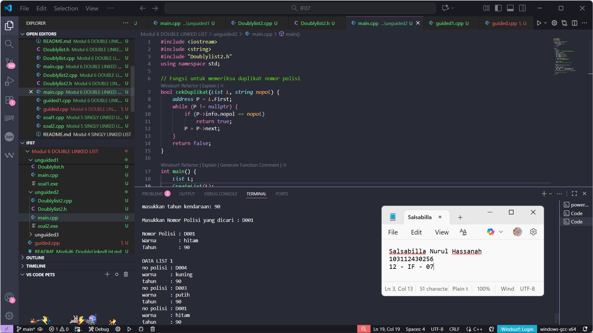
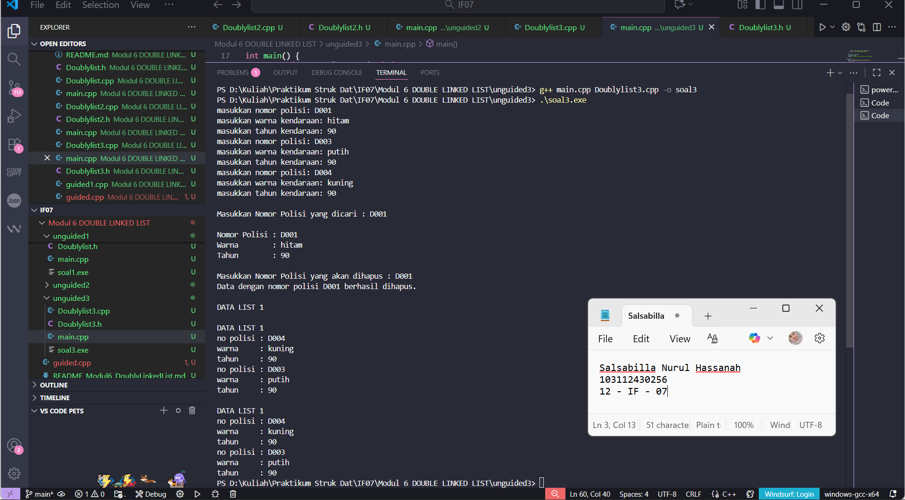

# <h1 align="center">Laporan Praktikum Modul 6 <br> DOUBLY LINKED LIST (Bagian Pertama)</h1>
<p align="center">Salsabilla Nurul Hassanah - 103112430256</p>

---

## Dasar Teori

### Pengertian Doubly Linked List

**Doubly Linked List** adalah struktur data berantai yang setiap elemennya memiliki dua penunjuk (*pointer*), yaitu:
- `next` → menunjuk ke elemen berikutnya, dan
- `prev` → menunjuk ke elemen sebelumnya.

Berbeda dengan *Singly Linked List* yang hanya bisa diakses satu arah, **Doubly Linked List** dapat diakses dari dua arah (maju dan mundur), sehingga mempermudah operasi seperti *insert* dan *delete* di bagian awal maupun akhir list.

### Komponen Doubly Linked List

1. **First** : pointer yang menunjuk elemen pertama.  
2. **Last** : pointer yang menunjuk elemen terakhir.  
3. **Next** : pointer yang menunjuk elemen sesudahnya.  
4. **Prev** : pointer yang menunjuk elemen sebelumnya.

---

## Guided

### Soal Guided – Implementasi Dasar *Doubly Linked List* (Manajemen Kendaraan)

Program ini mengimplementasikan **ADT Doubly Linked List** untuk menyimpan data kendaraan (nopol, warna, tahun pembuatan).

#### Program:
```cpp
#include <iostream>
#include <string>
using namespace std;

struct Kendaraan {
    string nopol, warna;
    int thnBuat;
    Kendaraan* next;
    Kendaraan* prev;
};

Kendaraan* first = nullptr;
Kendaraan* last = nullptr;

void insertLast(string nopol, string warna, int thn) {
    Kendaraan* newNode = new Kendaraan();
    newNode->nopol = nopol;
    newNode->warna = warna;
    newNode->thnBuat = thn;
    newNode->next = nullptr;
    newNode->prev = last;

    if (first == nullptr)
        first = newNode;
    else
        last->next = newNode;

    last = newNode;
}

void printInfo() {
    Kendaraan* temp = first;
    cout << "\nDaftar Kendaraan:\n";
    while (temp != nullptr) {
        cout << "Nopol: " << temp->nopol
             << " | Warna: " << temp->warna
             << " | Tahun: " << temp->thnBuat << endl;
        temp = temp->next;
    }
}

int main() {
    insertLast("D001", "Merah", 2010);
    insertLast("D002", "Hitam", 2012);
    insertLast("D003", "Putih", 2015);

    printInfo();
    return 0;
}
```

#### Penjelasan Program:

1. **Struct `Kendaraan`** menyimpan tiga atribut utama (nopol, warna, tahun) dan dua pointer (`next`, `prev`).
2. **Fungsi `insertLast`** menambahkan node baru di akhir list.
3. **Fungsi `printInfo`** menampilkan seluruh isi list.
4. Program utama (`main`) menambahkan tiga data kendaraan dan mencetak seluruh isi list.

#### Output:
> 

---

## Unguided

### Soal – Latihan Doubly Linked List Kendaraan

Buat ADT Doubly Linked List yang menyimpan data kendaraan (`nopol`, `warna`, `thnBuat`). Implementasikan fungsi berikut:
- `CreateList()`  
- `insertLast()`  
- `findElm()` (mencari berdasarkan nomor polisi)  
- `deleteFirst()`, `deleteLast()`, dan `deleteAfter()`

#### Dooblylist.h
```cpp
#ifndef DOUBLYLIST_H
#define DOUBLYLIST_H

#include <string>
using namespace std;

struct Kendaraan {
    string nopol;
    string warna;
    int thnBuat;
};

typedef Kendaraan infotype;
typedef struct ElmList *address;

struct ElmList {
    infotype info;
    address next;
    address prev;
};

struct List {
    address First;
    address Last;
};

void CreateList(List &L);
address alokasi(infotype x);
void dealokasi(address &P);
void insertLast(List &L, address P);
void printInfo(List L);

#endif

```
#### Dooblylist.cpp
```cpp
#include <iostream>
#include "Doublylist.h"
using namespace std;

void CreateList(List &L) {
    L.First = nullptr;
    L.Last = nullptr;
}

address alokasi(infotype x) {
    address P = new ElmList;
    P->info = x;
    P->next = nullptr;
    P->prev = nullptr;
    return P;
}

void dealokasi(address &P) {
    delete P;
    P = nullptr;
}

void insertLast(List &L, address P) {
    if (L.First == nullptr) {
        L.First = P;
        L.Last = P;
    } else {
        L.Last->next = P;
        P->prev = L.Last;
        L.Last = P;
    }
}

void printInfo(List L) {
    if (L.First == nullptr) {
        cout << "List kosong.\n";
        return;
    }

    address P = L.Last; // tampil mundur seperti contoh modul
    cout << "\nDATA LIST 1\n";
    while (P != nullptr) {
        cout << "no polisi : " << P->info.nopol << endl;
        cout << "warna     : " << P->info.warna << endl;
        cout << "tahun     : " << P->info.thnBuat << endl;
        P = P->prev;
    }
}

```
#### main.cpp
```cpp
#include <iostream>
#include <string>
#include "Doublylist.h"
using namespace std;

// Fungsi untuk memeriksa duplikat nomor polisi
bool cekDuplikat(List L, string nopol) {
    address P = L.First;
    while (P != nullptr) {
        if (P->info.nopol == nopol)
            return true;
        P = P->next;
    }
    return false;
}

int main() {
    List L;
    CreateList(L);

    int jumlahInput = 3;  // jumlah kendaraan yang diinginkan
    int count = 0;        // penghitung data yang berhasil disimpan

    while (count < jumlahInput) {
        infotype x;
        cout << "masukkan nomor polisi: ";
        cin >> x.nopol;
        cout << "masukkan warna kendaraan: ";
        cin >> x.warna;
        cout << "masukkan tahun kendaraan: ";
        cin >> x.thnBuat;

        if (cekDuplikat(L, x.nopol)) {
            cout << "nomor polisi sudah terdaftar\n";
            continue; // tidak menambah count
        }

        address P = alokasi(x);
        insertLast(L, P);
        count++; // hanya naik kalau data berhasil disimpan
    }

    // setelah loop selesai, tampilkan hasil
    printInfo(L);

    return 0;
}


```
#### Penjelasan Program:
1. **Struct `Kendaraan`** menyimpan tiga atribut utama (nopol, warna, tahun) dan dua pointer (`next`, `prev`).
    
2. **Fungsi `insertLast`** menambahkan node baru di akhir list.
    
3. **Fungsi `printInfo`** menampilkan seluruh isi list.
    
4. Program utama (`main`) menambahkan tiga data kendaraan dan mencetak seluruh isi list.

#### Output:
> 

## Unguided 2 – Fungsi Pencarian (`findElm`)
### Deskripsi
Menambahkan fitur pencarian data kendaraan berdasarkan **nomor polisi** menggunakan fungsi `findElm()`.

### Program Tambahan:
```cpp
address findElm(List L, string nopol) {
    address P = L.First;
    while (P != nullptr) {
        if (P->info.nopol == nopol)
            return P;
        P = P->next;
    }
    return nullptr;
}


```
### Tambahan di Dooblylist.h
```cpp
address findElm(List L, string nopol);

```
### Pemanggilan di main.cpp:
```cpp
string cari;
cout << "\nMasukkan Nomor Polisi yang dicari : ";
cin >> cari;

address hasil = findElm(L, cari);
if (hasil != nullptr) {
    cout << "\nNomor Polisi : " << hasil->info.nopol << endl;
    cout << "Warna        : " << hasil->info.warna << endl;
    cout << "Tahun        : " << hasil->info.thnBuat << endl;
} else {
    cout << "\nData dengan nomor polisi " << cari << " tidak ditemukan.\n";
}

```
Output:
```cpp
Masukkan Nomor Polisi yang dicari : D001
Nomor Polisi : D001
Warna        : hitam
Tahun        : 90

```
#### Penjelasan Program:
Program di atas sama dengan program di unguided 1, hanya menambahkan fitur pencarian data kendaraan berdasarkan **nomor polisi** menggunakan fungsi `findElm()`

#### Output:
> 


### Unguided 3 – Menghapus Elemen (`deleteFirst`, `deleteLast`, `deleteAfter`)

### Deskripsi

Menambahkan fitur untuk **menghapus kendaraan berdasarkan nomor polisi** menggunakan 3 prosedur delete.
#### Tambahan di Dooblylist.h
```cpp
void deleteFirst(List &L, address &P);
void deleteLast(List &L, address &P);
void deleteAfter(address Prec, address &P);

```
#### Tambahan di Dooblylist.cpp
```cpp
void deleteFirst(List &L, address &P) {
    if (L.First == nullptr)
        P = nullptr;
    else if (L.First == L.Last) {
        P = L.First;
        L.First = nullptr;
        L.Last = nullptr;
    } else {
        P = L.First;
        L.First = L.First->next;
        L.First->prev = nullptr;
        P->next = nullptr;
    }
}

void deleteLast(List &L, address &P) {
    if (L.First == nullptr)
        P = nullptr;
    else if (L.First == L.Last) {
        P = L.Last;
        L.First = nullptr;
        L.Last = nullptr;
    } else {
        P = L.Last;
        L.Last = L.Last->prev;
        L.Last->next = nullptr;
        P->prev = nullptr;
    }
}

void deleteAfter(address Prec, address &P) {
    if (Prec == nullptr || Prec->next == nullptr)
        P = nullptr;
    else {
        P = Prec->next;
        Prec->next = P->next;
        if (P->next != nullptr)
            P->next->prev = Prec;
        P->next = nullptr;
        P->prev = nullptr;
    }
}


```
### Tambahkan logika hapus di main.cpp
```cpp
string hapus;
cout << "\nMasukkan Nomor Polisi yang akan dihapus : ";
cin >> hapus;

address target = findElm(L, hapus);
if (target == nullptr) {
    cout << "Data dengan nomor polisi " << hapus << " tidak ditemukan.\n";
} else {
    address P;
    if (target == L.First)
        deleteFirst(L, P);
    else if (target == L.Last)
        deleteLast(L, P);
    else
        deleteAfter(target->prev, P);

    cout << "Data dengan nomor polisi " << hapus << " berhasil dihapus.\n";
    delete P; // dealokasi
}

cout << "\nDATA LIST 1\n";
printInfo(L);

```

#### Penjelasan Program:
program di atas seperti biasa sama saja seperti program utama yang ada di   unguided 1, hanya menambahkan fitur untuk menghapus kendaraan berdasarkan nomor polisi menggunakan 3 prosedur delete.

#### Output:
> 

---

## Referensi

1. Modul Praktikum Struktur Data, **Modul 06 – Doubly Linked List (Bagian Pertama)**, Telkom University, 2025.  
2. Malik, D. S. (2018). *C++ Programming: From Problem Analysis to Program Design*. Cengage Learning.  
3. Goodrich, M. T., Tamassia, R., & Goldwasser, M. H. (2014). *Data Structures and Algorithms in C++*. Wiley.  
4. GeeksforGeeks. (2024). [Doubly Linked List in C++](https://www.geeksforgeeks.org/doubly-linked-list/)  
5. TutorialsPoint. (2024). [C++ Doubly Linked List](https://www.tutorialspoint.com/cplusplus/cpp_doubly_linked_list.htm)
