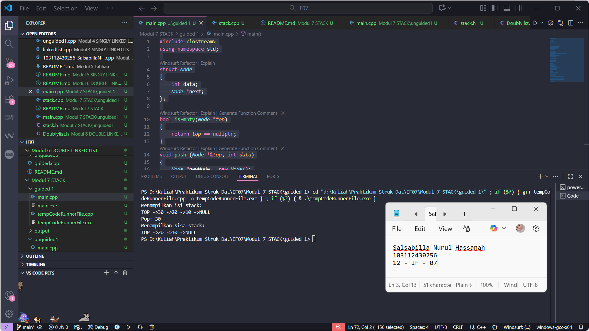
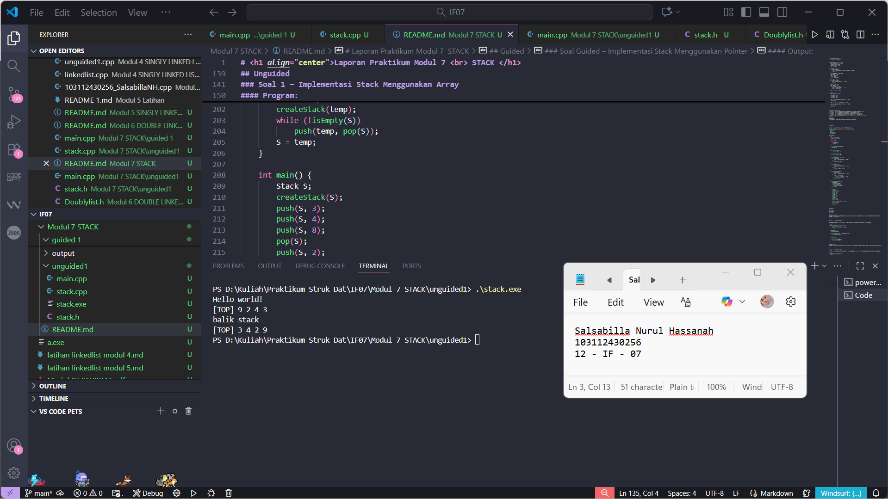
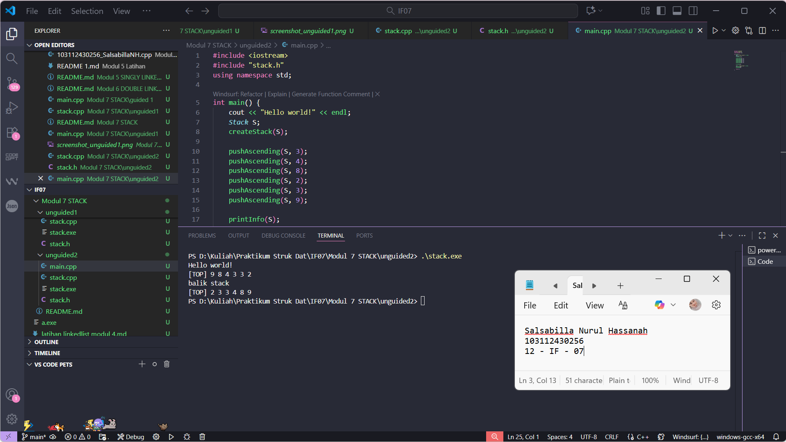
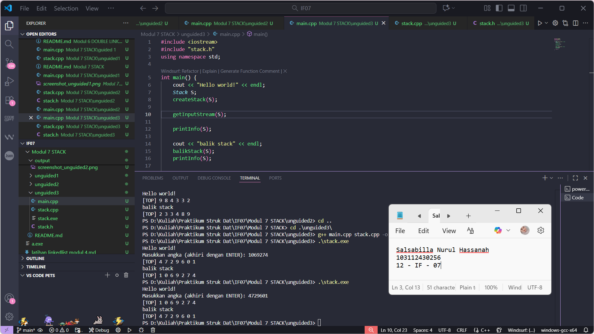

# <h1 align="center">Laporan Praktikum Modul 7 <br> STACK </h1>
<p align="center">Salsabilla Nurul Hassanah - 103112430256</p>

---

## Dasar Teori

### Pengertian Stack

**Stack** merupakan salah satu bentuk struktur data yang prinsip operasinya seperti tumpukan.  
Elemen yang **paling akhir dimasukkan** ke dalam stack adalah **elemen pertama yang diambil**,  
dikenal dengan prinsip **LIFO (Last In First Out)**.

### Komponen-Komponen Stack

Komponen utama dalam stack adalah:
1. **Top** → menunjuk ke elemen paling atas dari stack.  
2. **Elemen Stack** → simpul-simpul data yang saling terhubung.  
3. **Operasi Push dan Pop** → untuk menambah dan menghapus elemen dari stack.

### Operasi-Operasi Utama

1. **Push**  
   Menyisipkan elemen baru ke dalam stack di posisi paling atas.  
   Jika direpresentasikan dengan pointer:
   ```cpp
   void push(address P){
       P->next = S.Top;
       S.Top = P;
   }
   ```

2. **Pop**  
   Menghapus elemen paling atas dari stack dan mengembalikan nilainya:
   ```cpp
   address pop(address P){
       P = S.Top;
       S.Top = (S.Top)->next;
       return P;
   }
   ```

3. **isEmpty()**  
   Mengecek apakah stack kosong atau tidak.  

4. **Representasi Tabel (Array)**  
   Stack juga dapat direpresentasikan dengan array, di mana posisi `TOP` bergeser sesuai operasi `push` dan `pop`.

---

## Guided

### Soal Guided – Implementasi Stack Menggunakan Pointer

Program berikut mengimplementasikan struktur data **stack** menggunakan pointer untuk melakukan operasi `push`, `pop`, dan `show`.

#### Program:
```cpp
#include <iostream>
using namespace std;

struct Node {
    int data;
    Node *next;
};

bool isEmpty(Node *top) {
    return top == nullptr;
}

void push(Node *&top, int data) {
    Node *newNode = new Node();
    newNode->data = data;
    newNode->next = top;
    top = newNode;
}

int pop(Node *&top) {
    if (isEmpty(top)) {
        cout << "Stack Kosong, tidak bisa pop!" << endl;
        return 0;
    }
    int poppedData = top->data;
    Node *temp = top;
    top = top->next;
    delete temp;
    return poppedData;
}

void show(Node *top) {
    if (isEmpty(top)) {
        cout << "Stack Kosong." << endl;
        return;
    }
    cout << "TOP -> ";
    Node *temp = top;
    while (temp != nullptr) {
        cout << temp->data << " -> ";
        temp = temp->next;
    }
    cout << "NULL" << endl;
}

int main() {
    Node *stack = nullptr;

    push(stack, 10);
    push(stack, 20);
    push(stack, 30);

    cout << "Menampilkan isi stack: " << endl;
    show(stack);

    cout << "Pop: " << pop(stack) << endl;

    cout << "Menampilkan sisa stack: " << endl;
    show(stack);

    return 0;
}
```

#### Penjelasan Program:
1. **Struct `Node`** digunakan untuk menyimpan data integer dan pointer `next`.
2. **Fungsi `push`** menambahkan elemen baru di bagian atas stack.
3. **Fungsi `pop`** menghapus elemen teratas dan mengembalikan nilainya.
4. **Fungsi `show`** menampilkan seluruh isi stack dari `TOP` hingga `NULL`.
5. Program utama melakukan operasi **push**, **pop**, dan **tampilkan isi stack**.

#### Output:
> 

```
```
---

## Unguided

### Soal 1 – Implementasi Stack Menggunakan Array

Buatlah **ADT Stack menggunakan array** dengan operasi:
- `createStack()`
- `push()`
- `pop()`
- `printInfo()`
- `balikStack()`

#### stack.h
```cpp
#ifndef STACK_H
#define STACK_H

#define MAX 20

struct Stack {
    int info[MAX];
    int top;
};

void createStack(Stack &S);
bool isEmpty(Stack S);
bool isFull(Stack S);
void push(Stack &S, int x);
int pop(Stack &S);
void printInfo(Stack S);
void balikStack(Stack &S);

#endif


```
#### stack.cpp
```cpp
#include <iostream>
#include "stack.h"
using namespace std;

void createStack(Stack &S) {
    S.top = 0;
}

bool isEmpty(Stack S) {
    return S.top == 0;
}

bool isFull(Stack S) {
    return S.top == MAX;
}

void push(Stack &S, int x) {
    if (isFull(S)) {
        cout << "Stack penuh!" << endl;
    } else {
        S.info[++S.top] = x;
    }
}

int pop(Stack &S) {
    if (isEmpty(S)) {
        cout << "Stack kosong!" << endl;
        return 0;
    } else {
        return S.info[S.top--];
    }
}

void printInfo(Stack S) {
    if (isEmpty(S)) {
        cout << "Stack kosong!" << endl;
    } else {
        cout << "[TOP] ";
        for (int i = S.top; i >= 1; i--) {
            cout << S.info[i] << " ";
        }
        cout << endl;
    }
}

void balikStack(Stack &S) {
    Stack temp;
    createStack(temp);
    while (!isEmpty(S)) {
        push(temp, pop(S));
    }
    S = temp;
}


```
#### main.cpp
```cpp
#include <iostream>
#include "stack.h"
using namespace std;

int main() {
    cout << "Hello world!" << endl;

    Stack S;
    createStack(S);

    push(S, 3);
    push(S, 4);
    push(S, 8);
    pop(S);
    push(S, 2);
    push(S, 3);
    pop(S);
    push(S, 9);

    printInfo(S);

    cout << "balik stack" << endl;
    balikStack(S);
    printInfo(S);

    return 0;
}
```
#### Penjelasan Program:
Pada soal pertama, stack diimplementasikan menggunakan array berukuran tetap sebagai tempat penyimpanan data. Operasi dasar yang digunakan meliputi createStack() untuk inisialisasi stack kosong, push() untuk menambah elemen di posisi paling atas, pop() untuk menghapus elemen teratas, printInfo() untuk menampilkan isi stack dari atas ke bawah, dan balikStack() untuk membalik urutan elemen di dalam stack. Prinsip kerja stack adalah LIFO (Last In First Out), di mana elemen terakhir yang dimasukkan akan menjadi elemen pertama yang dikeluarkan. Melalui implementasi ini, mahasiswa memahami cara kerja dasar struktur data stack menggunakan representasi array.

#### Output:
> 
---

### Soal 2 – pushAscending()

Menambahkan prosedur `pushAscending()` agar data yang dimasukkan selalu dalam urutan menaik.

```cpp
//stack.h Tambahan cuman ini
void pushAscending(Stack &S, int x);

//stack.cpp Tambahan
void pushAscending(Stack &S, int x) {
    if (isFull(S)) {
        cout << "Stack penuh!" << endl;
        return;
    }

    Stack temp;
    createStack(temp);

    while (!isEmpty(S) && S.info[S.top] > x) {
        push(temp, pop(S));
    }

    push(S, x);

    while (!isEmpty(temp)) {
        push(S, pop(temp));
    }
}

//main.cpp Tambahan dan sedikit modif
#include <iostream>
#include "stack.h"
using namespace std;

int main() {
    cout << "Hello world!" << endl;
    Stack S;
    createStack(S);

    pushAscending(S, 3);
    pushAscending(S, 4);
    pushAscending(S, 8);
    pushAscending(S, 2);
    pushAscending(S, 3);
    pushAscending(S, 9);

    printInfo(S);

    cout << "balik stack" << endl;
    balikStack(S);
    printInfo(S);

    return 0;
}


```

#### Penjelasan:
Soal kedua menambahkan prosedur pushAscending() untuk menjaga agar elemen di dalam stack selalu tersusun secara menaik (ascending). Mekanisme ini dilakukan dengan memanfaatkan stack sementara (temp) untuk menampung elemen yang lebih besar dari nilai baru yang akan dimasukkan. Setelah posisi yang tepat ditemukan, elemen baru disisipkan, dan elemen sementara dikembalikan lagi ke stack utama. Dengan cara ini, setiap kali pushAscending() dijalankan, data akan otomatis tersimpan dalam urutan terurut naik dari bawah ke atas tanpa perlu dilakukan pengurutan tambahan setelahnya.

#### Output:
> 

---

### Soal 3 – getInputStream()

Prosedur ini membaca input berulang dari user menggunakan `cin.get()` dan menyimpannya ke dalam stack hingga menekan enter.

```cpp
//Tamabahan dari soal yang di minta no 3:
//stack.h
void getInputStream(Stack &S);

//stack.cpp
void getInputStream(Stack &S) {
    char x;
    cout << "Masukkan angka (akhiri dengan ENTER): ";
    while (cin.get(x) && x != '\n') {
        if (isdigit(x)) {
            int val = x - '0';
            push(S, val);
        }
    }
}
//main cpp versi GetinputStream
#include <iostream>
#include "stack.h"
using namespace std;

int main() {
    cout << "Hello world!" << endl;
    Stack S;
    createStack(S);

    getInputStream(S);

    printInfo(S);

    cout << "balik stack" << endl;
    balikStack(S);
    printInfo(S);

    return 0;
}


```

### Penjelasan :
Pada soal ketiga, ditambahkan prosedur getInputStream() yang memungkinkan pengguna untuk memasukkan data secara interaktif menggunakan cin.get(). Setiap karakter atau angka yang dimasukkan sebelum menekan tombol ENTER akan dimasukkan ke dalam stack satu per satu menggunakan operasi push(). Setelah input selesai, pengguna dapat menampilkan isi stack menggunakan printInfo() dan membalik urutan datanya dengan balikStack(). Soal ini mengajarkan konsep pengolahan input dinamis dan penerapan stack dalam konteks aliran data langsung dari pengguna.

#### Output:
> 


## Referensi

1. **Modul Praktikum Struktur Data – Modul 07: Stack**, Telkom University, 2025.  
2. Malik, D. S. (2018). *C++ Programming: From Problem Analysis to Program Design*. Cengage Learning.  
3. Goodrich, M. T., Tamassia, R., & Goldwasser, M. H. (2014). *Data Structures and Algorithms in C++*. Wiley.  
4. GeeksforGeeks. (2024). [Stack Data Structure in C++](https://www.geeksforgeeks.org/stack-data-structure-introduction-program/)  
5. TutorialsPoint. (2024). [C++ Stack](https://www.tutorialspoint.com/cplusplus/cpp_stack.htm)
