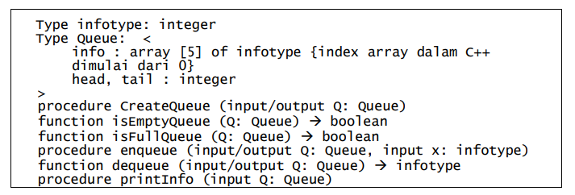
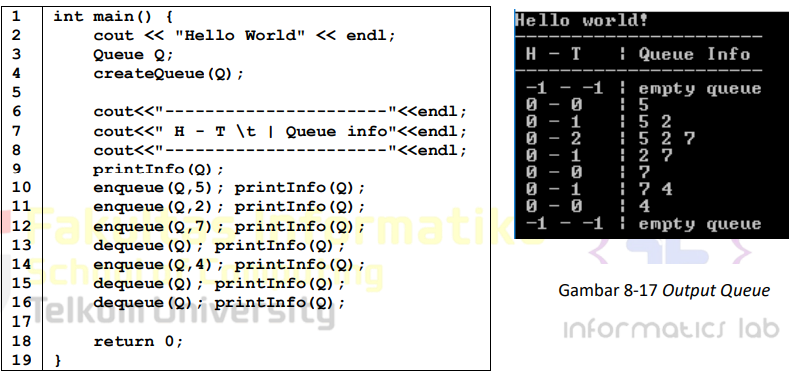
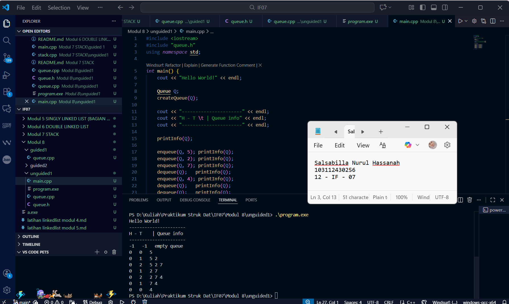
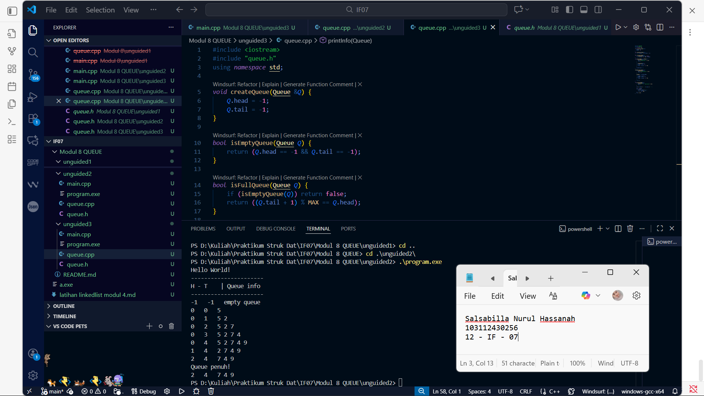

# <h1 align="center">Laporan Praktikum Modul 8 <br> QUEUE </h1>
<p align="center">Salsabilla Nurul Hassanah - 103112430256</p>

---
## Dasar Teori

### Pengertian Queue

Queue adalah struktur data linear yang bekerja dengan prinsip FIFO
(First In First Out), di mana elemen yang pertama masuk menjadi elemen
yang pertama keluar. Contohnya seperti antrean loket, orang yang datang
lebih dulu akan dilayani lebih dulu.

### Komponen Queue

-   **Head** -- Elemen terdepan (keluar duluan)
-   **Tail** -- Elemen terakhir (masuk terakhir)
-   **Info** -- Data dalam queue
-   Operasi: **enqueue**, **dequeue**, **isEmpty**, **isFull**

------------------------------------------------------------------------

## Guided -- Queue Pointer

### Kode Program

``` cpp
#include <iostream>
using namespace std;

struct Node {
    int info;
    Node* next;
};

bool isEmpty(Node* head) {
    return head == NULL;
}

void enqueue(Node* &head, Node* &tail, int x) {
    Node* baru = new Node();
    baru->info = x;
    baru->next = NULL;

    if (isEmpty(head)) {
        head = tail = baru;
    } else {
        tail->next = baru;
        tail = baru;
    }
}

void dequeue(Node* &head, Node* &tail) {
    if (isEmpty(head)) {
        cout << "Queue kosong, tidak bisa dequeue!" << endl;
    } else {
        Node* hapus = head;
        cout << "Menghapus: " << hapus->info << endl;
        head = head->next;

        if (head == NULL) tail = NULL;
        delete hapus;
    }
}

void printQueue(Node* head) {
    if (isEmpty(head)) {
        cout << "Queue kosong." << endl;
    } else {
        cout << "HEAD -> ";
        Node* p = head;
        while (p != NULL) {
            cout << p->info << " -> ";
            p = p->next;
        }
        cout << "NULL" << endl;
    }
}

int main() {
    Node* head = NULL;
    Node* tail = NULL;

    enqueue(head, tail, 10);
    enqueue(head, tail, 20);
    enqueue(head, tail, 30);

    printQueue(head);

    dequeue(head, tail);
    printQueue(head);

    return 0;
}
```

### Screenshot Output


### Penjelasan

Program guided ini membuat antrean menggunakan pointer. Setiap elemen
baru masuk melalui tail dan elemen paling depan keluar lewat head.
Karena memakai linked list, antrean dapat bertambah tanpa batas ukuran
array dan tidak butuh shifting data.

------------------------------------------------------------------------

# Unguided 1 -- Alternatif 1 (Head Diam, Tail Bergerak)

1. Buatlah ADT Queue menggunakan ARRAY sebagai berikut di dalam file “queue.h”:
	
	

Buatlah implementasi ADT Queue pada file “queue.cpp” dengan menerapkan mekanisme queue Alternatif 1 (head diam, tail bergerak).

### queue.h
```cpp
#ifndef QUEUE_H
#define QUEUE_H

#define MAX 5
typedef int infotype;

struct Queue {
    infotype info[MAX];
    int head;
    int tail;
};

void createQueue(Queue &Q);
bool isEmptyQueue(Queue Q);
bool isFullQueue(Queue Q);
void enqueue(Queue &Q, infotype x);
infotype dequeue(Queue &Q);
void printInfo(Queue Q);

#endif
```

### queue.cpp
```cpp
#include <iostream>
#include "queue.h"
using namespace std;

void createQueue(Queue &Q) {
    Q.head = -1;
    Q.tail = -1;
}

bool isEmptyQueue(Queue Q) {
    return (Q.head == -1 && Q.tail == -1);
}

bool isFullQueue(Queue Q) {
    return (Q.tail == MAX - 1);
}

// Enqueue Alternatif 1
void enqueue(Queue &Q, infotype x) {
    if (isFullQueue(Q)) {
        cout << "Queue penuh!" << endl;
    } else {
        if (isEmptyQueue(Q)) {
            Q.head = Q.tail = 0;
        } else {
            Q.tail++;
        }
        Q.info[Q.tail] = x;
    }
}

// Dequeue Alternatif 1 (shifting)
infotype dequeue(Queue &Q) {
    if (isEmptyQueue(Q)) {
        cout << "Queue kosong!" << endl;
        return -1;
    }

    infotype x = Q.info[Q.head];

    if (Q.head == Q.tail) {
        Q.head = Q.tail = -1;
    } 
    else {
        for (int i = Q.head; i < Q.tail; i++) {
            Q.info[i] = Q.info[i + 1];
        }
        Q.tail--;
    }

    return x;
}

// Print sesuai format modul
void printInfo(Queue Q) {
    cout << Q.head << "   " << Q.tail << "   ";

    if (isEmptyQueue(Q)) {
        cout << "empty queue" << endl;
        return;
    }

    for (int i = Q.head; i <= Q.tail; i++) {
        cout << Q.info[i] << " ";
    }
    cout << endl;
}
```

### main.cpp
```cpp
#include <iostream>
#include "queue.h"
using namespace std;

int main() {
    cout << "Hello World!" << endl;

    Queue Q;
    createQueue(Q);

    cout << "----------------------" << endl;
    cout << "H - T \t | Queue info" << endl;
    cout << "----------------------" << endl;

    printInfo(Q);

    enqueue(Q, 5); printInfo(Q);
    enqueue(Q, 2); printInfo(Q);
    enqueue(Q, 7); printInfo(Q);
    dequeue(Q);   printInfo(Q);
    enqueue(Q, 4); printInfo(Q);
    dequeue(Q);   printInfo(Q);
    dequeue(Q);   printInfo(Q);

    return 0;
}
```

### Screenshot Output



### Penjelasan

Pada alternatif pertama ini, head akan tetap berada di index awal,
sedangkan tail maju setiap kali data ditambahkan. Saat dequeue, semua
data digeser agar posisi antrian tetap benar. Cara ini mudah dipahami
tetapi kurang efisien untuk dataset besar.

------------------------------------------------------------------------

# Unguided 2 -- Alternatif 2 (Head & Tail Bergerak)

#### Buatlah implementasi ADT Queue pada file “queue.cpp” dengan menerapkan mekanisme queue Alternatif 2 (head bergerak, tail bergerak).

### queue.cpp ada tambahan

``` cpp
void enqueue(Queue &Q, infotype x) {
    if (isFullQueue(Q)) {
        cout << "Queue penuh!" << endl;
        return;
    }

    if (isEmptyQueue(Q)) {
        Q.head = Q.tail = 0;
    } else {
        Q.tail++;
    }

    Q.info[Q.tail] = x;
}

infotype dequeue(Queue &Q) {
    if (isEmptyQueue(Q)) {
        cout << "Queue kosong!" << endl;
        return -1;
    }

    infotype x = Q.info[Q.head];
    if (Q.head == Q.tail) {
        Q.head = Q.tail = -1;
    } else {
        Q.head++;
    }
    return x;
}
```

### Screenshot Output


### Penjelasan

Alternatif kedua jauh lebih efisien dibanding alternatif pertama karena
tidak ada shifting. Head dan tail sama‑sama bergerak maju. Masalah yang
bisa muncul adalah kondisi "penuh semu" ketika tail mencapai batas array
padahal bagian depan sudah kosong.

------------------------------------------------------------------------

# Unguided 3 -- Alternatif 3 (Circular Queue)

#### Buatlah implementasi ADT Queue pada file “queue.cpp” dengan menerapkan mekanisme queue Alternatif 3 (head dan tail berputar).
### queue.cpp perubahan

``` cpp
void enqueue(Queue &Q, infotype x) {
    if (isFullQueue(Q)) {
        cout << "Queue penuh!" << endl;
        return;
    }

    if (isEmptyQueue(Q)) {
        Q.head = Q.tail = 0;
    } else {
        Q.tail = (Q.tail + 1) % MAX;
    }

    Q.info[Q.tail] = x;
}

infotype dequeue(Queue &Q) {
    if (isEmptyQueue(Q)) {
        cout << "Queue kosong!" << endl;
        return -1;
    }

    infotype x = Q.info[Q.head];
    if (Q.head == Q.tail) {
        Q.head = Q.tail = -1;
    } else {
        Q.head = (Q.head + 1) % MAX;
    }

    return x;
}
```

### Screenshot Output



### Penjelasan
Alternatif ketiga menggunakan konsep antrian melingkar, sehingga index tail dan head dapat kembali ke awal ketika mencapai batas array. Tidak ada shifting dan tidak ada ruang kosong yang terbuang, membuatnya menjadi metode queue paling efisien dari ketiga alternatif.

## Referensi

1.  Modul Praktikum Struktur Data -- Modul 08 Queue, Telkom University.
2.  Malik D.S., C++ Programming.
3.  Goodrich & Tamassia, Data Structures in C++.
4.  GeeksforGeeks -- Queue DS.
5.  TutorialsPoint -- Queue Basics.
